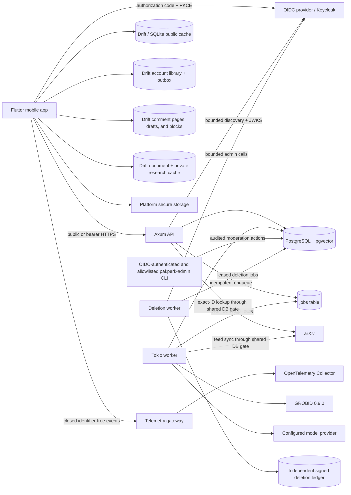

# Pakperk 架构

Pakperk 是一个模块化单体，包含 API、论文 worker、删除 worker、执行 schema 校验的遥测网关、
一次性迁移/管理工具和一个 PostgreSQL 数据库。API 负责短时请求/响应工作，包括读取缓存或按指定 ID
读取元数据、执行基于论文内容的聊天推理、同步账户与 Library，以及处理公开评论的安全操作。
论文 worker 负责后台元数据摄入、获取 PDF、使用 GROBID 解析、生成嵌入、解析参考文献和生成关系。
管理二进制程序提供明确且受审计的内容审核操作，无需创建第二套产品后端。各产品进程复用与传输方式
无关的领域类型和存储库；所有 arXiv 请求都经由同一个由数据库支持的限流门禁依次执行。

## Production v0.0 阶段状态

生产迁移详见 [Production v0.0 计划](production-v0.0-plan.md)。Phase 0–5 已获接受；
Phase 6 已实现账户生命周期、部署、遥测、供应链、签名构建和运行手册，但外部生产环境、
应用商店及恢复证据仍是 [Phase 6 报告](phase-reports/phase-6.md)列出的发布阻塞项。
完整的评论和内容审核实现及其真实双用户证据记录在 [Phase 5 报告](phase-reports/phase-5.md)中。
Flutter 客户端现已提供 Read/You 应用壳层和容量受限的关系型 Drift/SQLite 公开内容缓存，
同时保留现有 Rust 模块化单体和论文处理流水线。Phase 3 账户集成已经接受，其真实身份提供商、
数据库、原生构建和代码仓库门禁证据见[验证报告](phase-reports/phase-3.md)。Phase 4 增加了同步、
离线优先的 To Read 集合，具备按账户维护的修订号、持久幂等机制、墓碑重置和独立的写入紧急关闭开关；
相关证据见 [Phase 4 报告](phase-reports/phase-4.md)。

Phase 3 将身份能力保留在同一个产品后端中。Keycloak 是参考 OIDC 部署，但 JWT 校验、
Pakperk 账户映射和破坏性身份管理仍分别位于与提供商无关的独立边界中。PostgreSQL 保存本地账户
和共享限流桶；未引入账户、社交、队列或限流网络服务。To Read 操作仍位于同一后端和
PostgreSQL 数据库内。Phase 5 也把评论、举报、屏蔽、内容审核审计和共享 UGC 限制保留在该边界内。
评论发布可以通过独立的紧急关闭开关停止，同时继续提供读取和安全操作。账户删除现在形成一条独立门禁
控制的边界，包括 API、worker、身份提供商管理适配器、签名外部账本和恢复重放。公开启用评论仍须等待
目标环境演练，以及内容审核、删除、保留和应用商店政策证据全部就绪。

## Plan 02 队列优先发现状态

Plan 02 仍在同一模块化单体和 PostgreSQL 数据库内。其增量数据库迁移 12–18 扩展了规范 Library、
研究资料、受修订号约束的推荐记录、仅使用元数据的 Lookup/Explore、已保存查询、不含内容的交互事件、
阅读简报、订阅和感知队列状态的应用内通知。系统没有引入发现服务、搜索集群、事件权威数据源或第二条队列。
已实现的边界及默认关闭的依赖关系图记录在 [Plan 02 发现与 Library](discovery-and-library.md)中。

`ReadingFeedService` 始终位于推荐生成逻辑之上。它从同一个权威快照取得活动条目数、Library 修订号、
排除项以及队列/推荐候选项。推荐结果持久化，并在提供前重新检查 Library、研究资料和反馈的修订号。
搜索是一项显式导航操作；只有规范的 Library/导入写操作能够改变队列状态。不含内容的事件可以关闭或删除，
而无需借助它们重建产品状态。

高级推荐构建使用数据库迁移 18 新增、归账户所有的独立生成作业队列。worker 领取作业受到有界限制和
修订号约束；最终持久化和提供结果前，仍会重新检查 Library、研究资料和反馈的权威状态。
持久化的候选记录与续页坐标可确保分页稳定，同时不会让该 worker 队列成为第二个阅读信息流或
Library 权威数据源。

## Plan 03 Deep Reader 状态

Plan 03 是对同一单体和数据库的又一次增量扩展。当前数据库迁移边界为 schema 18 到 schema 24：
准备触发审计、与解析器无关的文档代次与对象、Passport/共享溯源信息/助手状态、按主体划定作用域的
注释与研究记忆、有界版本差异，以及原子注释归档导入。系统没有单独的研究记忆服务、向量存储或队列
权威状态服务。共享文档产物仍归论文及处理代次所有；笔记、证据卡、检查点、记忆和所有者的助手历史
仍按主体划定作用域。

GROBID 仍是生产解析器基线。当前 worker 对 Passport 的实现采用确定性的来源线索选择；当前
`stable-key-content-similarity-v2` 差异算法比较稳定对象键、精确哈希值和一个有界相似度信号。
两者都不代表其人工领域质量已经得到认可，也不代表语义文本编辑相似度已经验证。新代次会把有界的
后台注释重新锚定任务加入队列；不确定的模糊候选项只供审核，而用户指定的精确重新附加操作会保留在
私有历史中。Docling 已编译并作为实验受运行时功能开关控制，不具备默认选型权限。精确的 API、隐私、
保留和限制技术契约详见 [Deep Reader 与研究记忆](deep-reader-and-research-memory.md)。

全部九项服务端/Helm Plan 03 控制和十项移动端 Plan 03 构建控制都默认关闭。代码仓库中的实现和
合成测试夹具不能授权分阶段发布。具有代表性的解析器证据、人工 Passport/视觉证据、真实模型与真实遥测
证据、隐私/法律证据、签名真机证据、无障碍证据、预发布环境回滚证据和发布审批证据均仍为 `not_ready`。
移动端私有研究正文是普通 Drift/SQLite 文本，由操作系统应用沙箱、设备访问控制、平台文件保护和已配置的
备份政策保护；在完成威胁模型及迁移/恢复设计审核前，SQLCipher 延后采用。

数据库迁移必须保留下文说明的能力发布和阅读器状态转换不变量：允许预取元数据或摘要，
但 PDF 准备仍然是进入 Introduction 的已提交动作，或者一次显式重试。



## 身份与账户边界

当 `ACCOUNTS_ENABLED=false` 时，账户路由不会注册；提供访客阅读也不需要发起任何 OIDC 网络请求。
启用该功能后，校验器会精确核对颁发者、受众和算法，验证 Bearer 令牌，并在一个事务内把验证后的
`(issuer, subject)` 映射到一个本地账户。路由绝不会依据公开用户名、电子邮件、身份提供商资料字段或
客户端提交的用户 ID 进行授权。身份提供商不可用时，需要认证的路由会明确拒绝请求，
但公开服务的就绪状态不受影响。

移动客户端在系统浏览器中打开授权页面，把访问令牌保留在内存中，只将刷新/会话材料持久化到平台安全存储。
合并并发刷新请求后，可以在明确的安全政策下重放一次受到质询的请求。登出会清除安全数据和账户所有的数据，
但保留公开 Drift 缓存和阅读器恢复状态。确切的配置与线协议技术契约见
[账户认证与个人资料技术契约](account-authentication.md)。

只有在 `/v1/me` 验证当前认证纪元对应的指定账户 ID 后，远程 Library 同步才会开始。刷新凭据期间，
存储的账户 ID 可以限定离线数据显示范围，但无权授权上传待同步队列（outbox）或接受远程响应。
如身份不匹配，系统会先清除旧账户记录，再让新验证的账户开始同步。

同一道账户与认证纪元屏障还保护个性化评论页面、草稿和屏蔽投影。访客只能读取已发布评论。
发帖要求接受当前《条款》和《社区指南》并完成公开用户名设置；API 会执行规范化、确定性规则、
共享账户/来源限流，并调用已配置且与提供商无关的内容审核适配器。审核员服务中断或结论不确定时，
内容会保持私有，绝不会在失败时放行。普通诊断和列表工具不包含正文或举报详情。指定行为记录在
[评论与内容审核技术契约](comments-and-moderation.md)中。

## 能力发布

worker 不会把一篇论文视为不可分割的单一结果：

```text
metadata
  -> queued -> PDF -> GROBID
  -> Introduction committed and visible
  -> later-section chunks + embeddings -> Chat visible
  -> precise reference resolution + summaries -> Connections visible
```

每次写入都限定在 `(paper_id, generation)` 作用域内。新版 arXiv 论文会递增处理代次，
使当前能力标志失效，并让 API 无法再读取旧记录。作业输出具有唯一键，因此重试或租约过期
都不会复制当前产物。

设备端也执行同一边界。当刷新后的元数据改变 arXiv 版本时，客户端会先清除缓存的处理状态、
Introduction 和 Connections 数据，再发布新元数据。阅读器恢复状态和聊天缓存键包含 arXiv 版本；
应用包内的派生内容只有在版本与本地已知的最新论文版本一致时才会使用。

## 信任边界

- 移动客户端绝不选择 PDF URL。后端只有在验证标识符后，才会构造或接受可信的 arXiv URL。
- PDF 受到大小限制，只临时私有保存，并在解析后删除。
- 论文文本属于不可信的提示数据。
- 聊天检索始终按当前论文和处理代次过滤。
- 模型返回的内容块 ID 和引文上下文 ID，只有在所提供证据集合中确实存在时才会接受。
- 移动端私有研究记录未使用应用层加密；当前任何架构或发布文档都不得声称 Drift 数据库由 SQLCipher 支持，或由 Pakperk 提供静态加密。
- 参考文献链接要求置信度至少为 `0.90`；有歧义的候选项仍可阅读，但不提供链接。
- 管理员摄入通过本地 worker 命令完成，而不是不受限制的公开端点。
- Bearer 令牌只会附加到指定配置的 Pakperk API 源，绝不会发送给 arXiv 或其他外部 URL。
- OIDC 颁发者、主体标识、令牌、密钥和身份提供商载荷都不会出现在公开资料响应中，并会从诊断信息中脱敏。

## 离线预准备路径

预准备演示并不是第二套产品实现。预处理命令驱动普通的元数据、准备和作业流水线，并持久化普通 API 记录。
随后，`export_mobile_cache.sh` 通过公开 API 读回这些记录并创建恢复能力包。重新连接后，控制器会用后端响应
替换应用包内或设备缓存的响应，而不改变界面或类型。

种子清单能够识别各论文角色：五篇 `prepared: true` 论文采用该路径，而 LoRA `2106.09685v2` 为
`prepared: false`。元数据同步和信息流包含全部六篇论文；预处理、Introduction/Connections 导出和
内容质量评估只包含五篇已准备论文。验证还会检查 LoRA；除非它保持 `not_requested`，且没有 Introduction、
内容块、已解析参考文献或 Connections，否则验证失败。由此保留一篇确定性论文，用于真正的按需滑动验收流程。

代码仓库还包含一个标注清晰且经过人工审核的后备内容，让客户端在本地语料尚未处理前仍可演示。
该内容不会冒充实时解析输出；制作演示构建时，应通过导出步骤将其替换。
