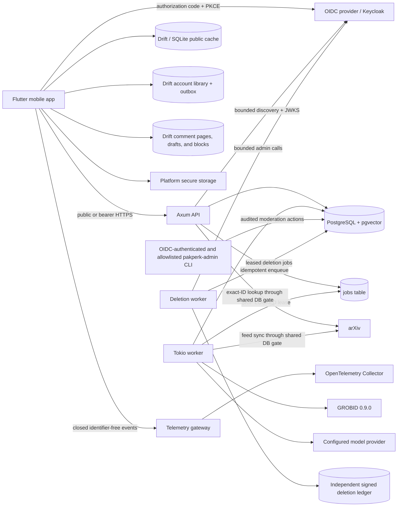

# Pakperk 架构

Pakperk 是一个模块化的单体应用，包含 API、论文处理工作线程、删除工作线程、schema 验证的遥测网关、一次性迁移/管理工具，以及一个 PostgreSQL 数据库。API 负责处理短时的请求/响应工作，包括缓存或精确 ID 的元数据读取、基于论文的聊天推理、账户/库同步，以及公开评论的安全操作。工作线程负责后台元数据摄入、PDF 获取、GROBID 解析、嵌入、参考文献解析和关系生成。管理二进制文件暴露了明确的、经过审计的审核操作，而无需创建第二个产品后端。产品处理过程重用了与传输无关的领域类型和仓库，每个 arXiv 请求都通过相同的数据库支持的速率限制网关进行序列化。

## 生产 v0.0 阶段状态

生产迁移在 [生产 v0.0 计划](production-v0.0-plan.md) 中定义。阶段 0-5 已接受；阶段 6 的账户生命周期、部署、遥测、供应链、签名构建和运行手册实现已存在，而外部生产/存储/恢复证据仍作为 [阶段 6 报告](phase-reports/phase-6.md) 中的发布阻塞项。完整的评论/审核实现及其实际的双用户证据记录在 [阶段 5 报告](phase-reports/phase-5.md) 中。Flutter 客户端现在具有 Read/You 壳层和一个有界的、关系型的 Drift/SQLite 公共内容缓存，而现有的 Rust 模块化单体和论文处理流程仍然保持完整。阶段 3 的账户集成已接受，其实际提供者、数据库、原生构建和仓库网关证据在 [验证报告](phase-reports/phase-3.md) 中。阶段 4 添加了一个同步的、以离线优先的“待读”集合，包含每个账户的修订、持久化的幂等性、墓碑重置和一个独立的写入关闭开关；其证据在 [阶段 4 报告](phase-reports/phase-4.md) 中。

阶段 3 保持身份在同一个产品后端内。Keycloak 是参考的 OIDC 部署，但 JWT 验证、Pakperk 账户映射和破坏性身份管理仍保持为独立的提供者中立边界。PostgreSQL 存储本地账户和共享速率限制桶；没有引入账户、社交、队列或速率限制的网络服务。待读操作仍保留在同一个后端和 PostgreSQL 数据库中。阶段 5 保持评论、报告、阻止、审核审计和共享 UGC 限制在同一个边界内。评论发布可以独立地关闭开关，而读取和安全操作仍保持在线。账户删除现在是一个独立的 API、工作线程、提供者管理适配器、签名的外部账本和恢复重放边界。公共评论启用仍需等待实际的环境、审核、删除、保留和存储策略证据。

迁移必须保持以下文档中所述的“能力发布”和“读者转换”不变量：元数据/摘要预取是允许的，但 PDF 准备仍然是一个提交到引言或显式重试的承诺动作。



## 身份和账户边界

当 `ACCOUNTS_ENABLED=false` 时，账户路由不会注册，且无需 OIDC 网络工作即可提供访客阅读。当该功能启用时，一个精确的颁发者/受众/算法验证器会验证 bearer token，并将其验证的 `(颁发者, 主题)` 映射到一个本地账户，事务性地进行。路由从不会根据句柄、电子邮件、提供者资料字段或客户端提供的用户 ID 进行授权。不可用的提供者会使需要认证的路由失败关闭，而不会使公共服务不可用。

移动客户端在系统浏览器中打开授权，将访问令牌保留在内存中，并仅在平台安全存储中持久化刷新/会话材料。一次单次刷新可以在显式安全策略下重放一次被挑战的请求。登出会清除安全和账户拥有的数据，同时保留公共 Drift 缓存和读者恢复。确切的设置和线协议在 [账户认证和资料协议](account-authentication.md) 中文档化。

远程库同步仅在 `/v1/me` 验证当前认证纪元的确切账户 ID 后才开始。存储的账户 ID 可能限制离线显示，但在凭证刷新期间，它不能授权 outbox 上传或远程响应。身份不匹配会在新验证的账户开始同步前清除旧账户行。

相同的账户和认证纪元边界保护了个性化评论页面、草稿和阻止投影。访客只能阅读已发布的评论。发布需要当前的条款和社区指南以及完整的句柄；API 应用规范化、确定性规则、共享账户/来源限制以及配置的提供者中立审核适配器。审核员停机或不确定的决定会将内容私有化，而不是失败开放。正文和报告详情不会包含在普通诊断和列表工具中。确切的行为在 [评论和审核协议](comments-and-moderation.md) 中文档化。

## 能力发布

工作线程不会将论文视为一个不可分割的结果：

```text
metadata
  -> queued -> PDF -> GROBID
  -> Introduction committed and visible
  -> later-section chunks + embeddings -> Chat visible
  -> precise reference resolution + summaries -> Connections visible
```

每个写入都由 `(paper_id, generation)` 限定。一个较新的 arXiv 版本会增加 generation，使当前能力标志失效，并使旧行对 API 读取不可用。作业输出有唯一的键，因此重试或过期租约无法重复当前的成果。

相同的边界在设备上也强制执行。当刷新的元数据更改 arXiv 版本时，客户端会在发布新元数据前清除缓存的处理、引言和连接数据。读者恢复和聊天缓存键包含 arXiv 版本，并且捆绑的衍生内容仅在版本与本地已知论文的最新版本匹配时才使用。

## 信任边界

- 移动客户端从不选择 PDF URL。后端仅在标识验证后构造或接受受信任的 arXiv URL。
- PDF 是有限的、临时的、私有的，并在解析后删除。
- 论文文本是不可信的提示数据。
- 聊天检索始终根据当前论文和生成版本进行过滤。
- 模型返回的块和引用上下文 ID 仅在它们存在于提供的证据集中时才被接受。
- 参考链接需要至少 `0.90` 的置信度；模糊的候选者保持可读但不链接。
- 管理摄入是本地工作线程命令，而不是不受限制的公共端点。
- Bearer 令牌仅附加到配置的 Pakperk API 原点，并且从不发送到 arXiv 或另一个外部 URL。
- OIDC 发行者、主题、令牌、密钥和提供者负载不在公共资料响应中出现，并且从诊断中删除。

## 离线准备路径

准备的演示不是一个第二产品实现。预处理命令驱动普通的元数据、准备和作业流水线，并持久化普通的 API 记录。`export_mobile_cache.sh` 然后通过公共 API 读取这些记录，并创建恢复包。在重新连接时，控制器会用后端响应替换捆绑或设备缓存的响应，而不会改变屏幕或类型。

种子清单是角色感知的：五个 `prepared: true` 论文走这条路，而 LoRA `2106.09685v2` 是 `prepared: false`。元数据同步和 feed 包括所有六个。预处理、引言/连接导出和内容质量评估仅包括准备的五个。验证还检查 LoRA 并失败，除非它保持 `not_requested`，没有引言、块、解析的参考文献或连接，从而保留一个确定性的论文，以供真正的懒惰滑动接受流程。

仓库还携带一个清晰标记、人工审核的备用方案，以便在本地语料库处理之前客户端仍可演示。它不被表示为实时解析输出，应通过导出步骤替换为演示构建。
