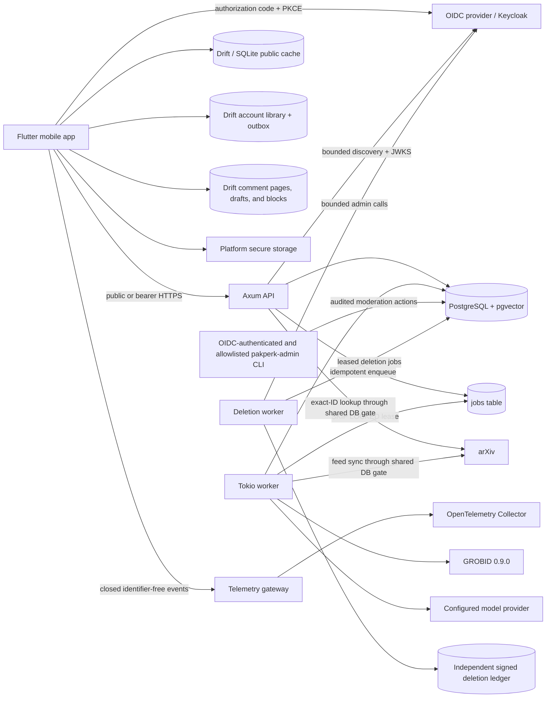

# Pakperk architecture

Pakperk is a modular monolith with an API, paper worker, deletion worker,
schema-validating telemetry gateway, one-shot migration/admin utilities, and
one PostgreSQL database. The API owns short
request/response work, including cached or exact-ID metadata reads,
paper-grounded chat inference, account/library synchronization, and public
comment safety operations. The worker owns background metadata ingestion, PDF
acquisition, GROBID parsing, embedding, reference resolution, and relationship
generation. The administration binary exposes explicit, audited moderation
operations without creating a second product backend. The product processes reuse
transport-independent domain types and repositories, and every arXiv request
is serialized through the same database-backed rate gate.

## Production v0.0 phase state

The production migration is specified in
[the Production v0.0 plan](production-v0.0-plan.md). Phases 0–5 are accepted;
Phase 6's account-lifecycle, deployment, telemetry, supply-chain, signed-build,
and runbook implementation is present, while external production/store/restore
evidence remains release-blocking in the [Phase 6 report](phase-reports/phase-6.md).
The complete comment/moderation implementation and its live two-user evidence
are recorded in the [Phase 5 report](phase-reports/phase-5.md). The Flutter
client now has the Read/You shell and a bounded relational
Drift/SQLite public-content cache, while the existing Rust modular monolith and
paper pipeline remain intact. Phase 3 account integration is accepted with its
live-provider, database, native-build, and repository-gate evidence in the
[verification report](phase-reports/phase-3.md). Phase 4 adds a synchronized,
offline-first To Read set with per-account revisions, durable idempotency,
tombstone reset, and an independent write kill switch; its evidence is in the
[Phase 4 report](phase-reports/phase-4.md).

Phase 3 keeps identity inside the same product backend. Keycloak is the
reference OIDC deployment, but JWT verification, Pakperk account mapping, and
destructive identity administration remain separate provider-neutral
boundaries. PostgreSQL stores local accounts and shared rate-limit buckets; no
account, social, queue, or rate-limit network service is introduced. To Read
operations remain in the same backend and PostgreSQL database. Phase 5 keeps
comments, reports, blocks, moderation audit, and shared UGC limits in that same
boundary. Comment publication is independently kill-switchable while reads and
safety actions remain live. Account deletion is now an independently gated API,
worker, provider-admin adapter, signed external ledger, and restore-replay
boundary. Public comment enablement still waits for exercised environment,
moderation, deletion, retention, and store-policy evidence.

The migration must preserve the capability-publication and reader-transition
invariants documented below: metadata/abstract prefetch is permitted, but PDF
preparation remains a committed move to Introduction or an explicit retry.



## Identity and account boundary

With `ACCOUNTS_ENABLED=false`, account routes are not registered and no OIDC
network work is needed to serve guest reading. With the feature enabled, an
exact issuer/audience/algorithm verifier validates a bearer token and maps its
verified `(issuer, subject)` to one local account transactionally. Routes never
authorize from a handle, email, provider profile field, or client-supplied user
ID. An unavailable provider makes required-auth routes fail closed without
making the public service unready.

The mobile client opens authorization in the system browser, keeps access
tokens in memory, and persists only refresh/session material in platform secure
storage. A single-flight refresh can replay a challenged request once under an
explicit safety policy. Sign-out clears secure and account-owned data while
preserving the public Drift cache and reader restoration. The exact setup and
wire contract are documented in
[Account authentication and profile contract](account-authentication.md).

Remote library synchronization starts only after `/v1/me` verifies the exact
account ID for the current authentication epoch. A stored account ID may scope
offline display while credentials refresh, but it cannot authorize an outbox
upload or remote response. Identity mismatch clears the old account rows before
the newly verified account begins synchronization.

The same account-and-auth-epoch barrier protects personalized comment pages,
drafts, and block projections. Guests read only published comments. Posting
requires the current Terms and Community Guidelines plus a complete handle;
the API applies normalization, deterministic rules, shared account/origin
limits, and the configured provider-neutral moderation adapter. A moderator
outage or uncertain decision holds content privately instead of failing open.
Bodies and report details are excluded from ordinary diagnostics and list
tooling. The exact behavior is documented in the
[comments and moderation contract](comments-and-moderation.md).

## Capability publication

The worker does not treat a paper as one indivisible result:

```text
metadata
  -> queued -> PDF -> GROBID
  -> Introduction committed and visible
  -> later-section chunks + embeddings -> Chat visible
  -> precise reference resolution + summaries -> Connections visible
```

Each write is scoped by `(paper_id, generation)`. A newer arXiv version
increments the generation, invalidates current capability flags, and leaves old
rows unavailable to API reads. Job outputs have unique keys, so a retry or an
expired lease cannot duplicate current artifacts.

The same boundary is enforced on-device. When refreshed metadata changes an
arXiv version, the client clears cached processing, Introduction, and
Connections data before publishing the new metadata. Reader restoration and
chat cache keys include the arXiv version, and bundled derived content is used
only when its version matches the latest locally known paper.

## Trust boundaries

- The mobile client never chooses a PDF URL. The backend constructs or accepts
  only trusted arXiv URLs after identifier validation.
- PDFs are bounded, temporary, private, and deleted after parsing.
- Paper text is untrusted prompt data.
- Chat retrieval always filters by the active paper and generation.
- Model-returned chunk and citation-context IDs are accepted only when they were
  in the supplied evidence set.
- Reference links require a confidence of at least `0.90`; ambiguous candidates
  stay readable but unlinked.
- Admin ingestion is a local worker command rather than an unrestricted public
  endpoint.
- Bearer tokens are attached only to the exact configured Pakperk API origin
  and are never sent to arXiv or another external URL.
- OIDC issuer, subject, token, key, and provider payloads are absent from public
  profile responses and redacted from diagnostics.

## Offline prepared path

The prepared demo is not a second product implementation. The preprocessing
command drives the ordinary metadata, preparation, and job pipeline and persists
the ordinary API records. `export_mobile_cache.sh` then reads those records back
through the public API and creates the resilience bundle. On reconnection,
controllers replace bundled or device-cached responses with backend responses
without changing screens or types.

The seed manifest is role-aware: five `prepared: true` papers take that path,
while LoRA `2106.09685v2` is `prepared: false`. Metadata synchronization and the
feed include all six. Preprocessing, Introduction/Connections export, and
content-quality evaluation include only the prepared five. Verification also
inspects LoRA and fails unless it remains `not_requested` with no Introduction,
chunks, resolved references, or connections, preserving a deterministic paper
for the genuine lazy-swipe acceptance flow.

The repository also carries a clearly labeled, manually reviewed fallback so
the client remains demonstrable before a local corpus has been processed. It is
not represented as live parsed output and should be replaced by the export step
for a presentation build.
