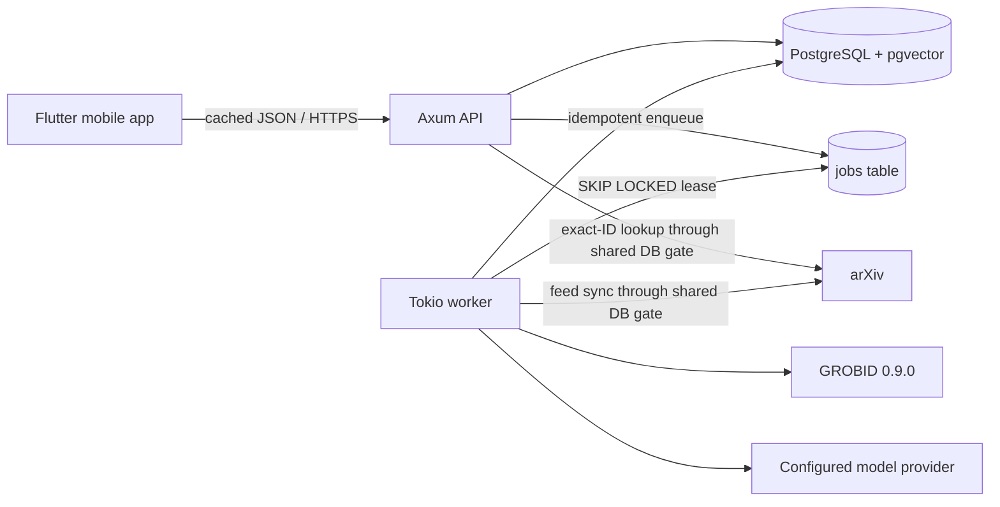

# Pakperk demo architecture

Pakperk is a modular monolith with two Rust processes and one PostgreSQL
database. The API owns short request/response work, including cached or exact-ID
metadata reads and paper-grounded chat inference. The worker owns background
metadata ingestion, PDF acquisition, GROBID parsing, embedding, reference
resolution, and relationship generation. Both reuse transport-independent
domain types and repositories, and every arXiv request is serialized through
the same database-backed rate gate.

## Production v0.0 direction

The production migration is specified in
[the Production v0.0 plan](production-v0.0-plan.md). The demo architecture
described here remains the current implemented architecture unless a section
explicitly says otherwise. The plan extends this modular monolith; it does not
introduce a separate account, social, queue, or rate-limiting service.

The planned target adds a Flutter Read/You stateful shell, Drift/SQLite for
relational device cache and a sync outbox, OIDC-authenticated user principals,
and PostgreSQL-backed shared write rate limits. Keycloak is the reference OIDC
deployment, but API JWT verification and destructive identity administration
are separated behind provider-neutral boundaries. Public comments and account
features are planned production capabilities, not current demo behavior.

The migration must preserve the capability-publication and reader-transition
invariants documented below: metadata/abstract prefetch is permitted, but PDF
preparation remains a committed move to Introduction or an explicit retry.



## Capability publication

The worker does not treat a paper as one indivisible result:

```text
metadata
  -> queued -> PDF -> GROBID
  -> Introduction committed and visible
  -> later-section chunks + embeddings -> Chat visible
  -> precise reference resolution + summaries -> Connections visible
```

Each write is scoped by `(paper_id, generation)`. A newer arXiv version
increments the generation, invalidates current capability flags, and leaves old
rows unavailable to API reads. Job outputs have unique keys, so a retry or an
expired lease cannot duplicate current artifacts.

The same boundary is enforced on-device. When refreshed metadata changes an
arXiv version, the client clears cached processing, Introduction, and
Connections data before publishing the new metadata. Reader restoration and
chat cache keys include the arXiv version, and bundled derived content is used
only when its version matches the latest locally known paper.

## Trust boundaries

- The mobile client never chooses a PDF URL. The backend constructs or accepts
  only trusted arXiv URLs after identifier validation.
- PDFs are bounded, temporary, private, and deleted after parsing.
- Paper text is untrusted prompt data.
- Chat retrieval always filters by the active paper and generation.
- Model-returned chunk and citation-context IDs are accepted only when they were
  in the supplied evidence set.
- Reference links require a confidence of at least `0.90`; ambiguous candidates
  stay readable but unlinked.
- Admin ingestion is a local worker command rather than an unrestricted public
  endpoint.

## Offline prepared path

The prepared demo is not a second product implementation. The preprocessing
command drives the ordinary metadata, preparation, and job pipeline and persists
the ordinary API records. `export_mobile_cache.sh` then reads those records back
through the public API and creates the resilience bundle. On reconnection,
controllers replace bundled or device-cached responses with backend responses
without changing screens or types.

The seed manifest is role-aware: five `prepared: true` papers take that path,
while LoRA `2106.09685v2` is `prepared: false`. Metadata synchronization and the
feed include all six. Preprocessing, Introduction/Connections export, and
content-quality evaluation include only the prepared five. Verification also
inspects LoRA and fails unless it remains `not_requested` with no Introduction,
chunks, resolved references, or connections, preserving a deterministic paper
for the genuine lazy-swipe acceptance flow.

The repository also carries a clearly labeled, manually reviewed fallback so
the client remains demonstrable before a local corpus has been processed. It is
not represented as live parsed output and should be replaced by the export step
for a presentation build.
