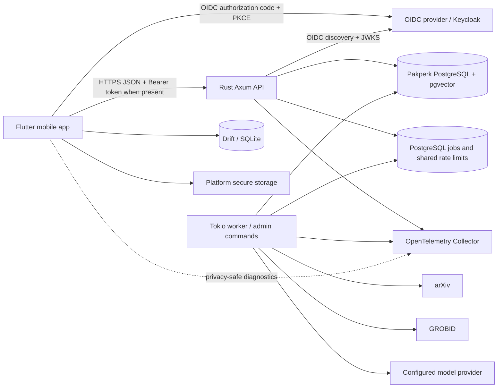

# Pakperk Production v0.0: Implementation Plan

**Document status:** Authoritative build specification for a coding agent  
**Prepared against repository:** `ErrDivine/PakPerk`  
**Baseline commit:** `8dd3bc6aab1ab0fe058c5ace8ab1107813cfb441` (`Init. Demo v0.1 complete.`)  
**Plan date:** 2026-07-31  
**Product milestone name:** Production v0.0  
**Client:** Flutter for iOS and Android  
**Backend:** Rust, Axum, Tokio, SQLx  
**Primary data store:** PostgreSQL 16 with pgvector  
**Paper source:** arXiv only  
**Architecture:** Modular monolith plus asynchronous worker  
**Primary release objective:** A store-ready early product with optional accounts, synchronized “To Read” saves, moderated paper comments, a polished Read/You shell, reliable startup motion, and predictive abstract caching.

> This document supersedes the account, comments, navigation-shell, and production-readiness non-goals in `pakperk_demo_implementation_plan.md`. It does **not** supersede the demo’s core paper-processing architecture, generation model, trust boundaries, full-text policy, or interaction thesis.

---

## 0. Coding-agent execution contract

Treat the following as hard rules.

1. **Do not rewrite the existing paper pipeline.** Preserve the Rust modular-monolith design, PostgreSQL-leased jobs, GROBID parsing, generation-scoped artifacts, provider-neutral model adapters, and current public paper endpoints.
2. **Preserve the reader’s central invariant:** metadata and abstracts may be prefetched, but `POST /v1/papers/{paper_id}/prepare` must still be triggered only by a committed user transition into Introduction or by an explicit retry. Widget construction, feed prefetch, app startup, account synchronization, and saved-list loading must never trigger PDF processing.
3. **Keep anonymous reading functional.** A user must be able to launch the app, browse abstracts, enter available Introduction/Connections content, use existing anonymous paper chat behavior, and open arXiv without creating an account. Sign-in is required only for cloud-owned features such as saving and posting comments.
4. **Keep every milestone releasable.** Run `./scripts/check.sh` before and after each milestone. Add tests together with behavior. Never leave the default branch in a migration-half-complete state.
5. **Use feature flags for incomplete production features.** Accounts, library, comments, and startup motion must be independently switchable in staging. A disabled flag must produce a coherent UI rather than a dead control.
6. **Do not store user passwords.** Pakperk is an OpenID Connect resource server and native client. Authentication is delegated to an OIDC provider.
7. **Never store access or refresh tokens in `SharedPreferences`, SQLite, logs, analytics, crash reports, or provider state snapshots.** Use platform secure storage; keep short-lived access tokens in memory whenever practical.
8. **Make all retried writes idempotent.** Saves, unsaves, comment creation, report creation, blocking, and account-deletion requests must tolerate duplicate mobile retries.
9. **Treat comments as public user-generated content.** Shipping comments requires terms acceptance, input filtering, reporting, blocking, moderation operations, rate limits, support contact information, and account deletion. Do not ship “comments first, safety later.”
10. **Use expand-and-contract database migrations.** Production API and worker instances may briefly run different versions during deployment. Do not combine a destructive column removal with the first release that stops reading it.
11. **Do not reduce the package version.** `mobile/pubspec.yaml` is already `0.1.0+1`. “Production v0.0” is a product milestone name, not a request to publish a lower semantic version. Use a monotonically increasing package version such as `0.2.0+<build>` or the next approved release number.
12. **Do not introduce a new network service without an architecture decision record.** PostgreSQL remains the job queue and synchronization source of truth for v0.0. Redis, Kafka, NATS, a graph database, and a separate social service are out of scope.
13. **No placeholder production data.** Bundled demo content remains available only as the clearly labeled resilience path already implemented. Production builds must not fabricate user accounts, comments, save counts, or social activity.
14. **Redact content from telemetry.** Never log abstract text, introduction text, chat prompts/answers, comment bodies, tokens, authorization headers, email addresses, or OIDC subject identifiers in plaintext.
15. **Re-audit the repository before implementation if `main` has moved beyond the baseline commit.** Apply this plan to the current structure rather than blindly replacing newer work.

---

## 1. Repository baseline and implications

### 1.1 Existing strengths to preserve

The demo is already substantially better than a disposable prototype:

- `mobile/` is a Flutter application using Riverpod and Dio, with resilient cached-first repositories.
- `backend/` is a Rust workspace with transport-independent domain types, SQLx persistence, Axum API handlers, a Tokio worker, provider-neutral model adapters, and structured tracing.
- PostgreSQL stores metadata, processing state, sections, chunks, references, connections, jobs, anonymous chat threads, arXiv caches, and a cross-process arXiv rate gate.
- Derived artifacts are scoped by `(paper_id, generation)`, and an arXiv version change invalidates current derived capabilities.
- The feed uses opaque cursor pagination and already loads more near the end of the vertical pager.
- The mobile repository already implements a useful stale-while-revalidate shape: show bundled/device data, refresh from the network, and invalidate derived data when the known arXiv version changes.
- Reader stage and scroll restoration are already explicit.
- Preparation is correctly attached to the committed horizontal transition into Introduction rather than to neighboring widget construction.
- The API already has stable error envelopes, request IDs, timeouts, CORS configuration, health endpoints, and basic rate limiting.
- Docker services run read-only with bounded temporary files.
- CI already runs Rust formatting, Clippy, workspace tests, Flutter formatting, analysis, and widget tests.
- The full-text policy is enforced both when artifacts are created and when they are served.

These are production seams. Extend them.

### 1.2 Structural gaps to address

The production work should target these concrete gaps:

| Area | Current implementation | Production gap |
|---|---|---|
| Application shell | Custom `Navigator` with feed root and paper routes | No independent Read/You tab stacks, deep-link-oriented route graph, or tab restoration |
| Device persistence | JSON blobs in `SharedPreferencesLocalStore` | No relational queries, schema migration, cache eviction, durable outbox, account-scoped data, or bounded prefetch cache |
| Authentication | Anonymous UUID in `X-Session-Id` | No OIDC login, secure token lifecycle, authenticated principal, or local user mapping |
| Data model | No `users`, library, comments, blocks, reports, or deletion jobs | Cannot implement synchronized saves or safe public UGC |
| API client | Static anonymous session ID; no auth interceptor | No bearer token attachment, single-flight refresh, retry-once behavior, or reauthentication path |
| API routing | All handlers in a large `backend/apps/api/src/lib.rs` | Adding cross-cutting auth and social routes would make the file difficult to maintain |
| DB persistence | Large repository module | User-owned repositories need authorization-aware, transaction-scoped boundaries |
| Feed cache | Initial page cached as one JSON object | No bounded multi-page cache, per-query entries, LRU/TTL, or saved-paper pinning |
| Prefetch | `loadMore` within three items of the end | Too late for variable networks; no explicit ahead window, deduplication, or metrics |
| Comments | None | UGC safety, moderation, report/block, edit/delete, and account-policy work all required |
| UI system | Good initial light palette and typography | No centralized spacing/motion/component tokens, dark theme, startup motion, account UI, or polished action hierarchy |
| Rate limiting | In-process limiter for anonymous demo endpoints | Inconsistent under multiple API replicas; user and UGC endpoints need shared enforcement |
| API contract | Hand-maintained server/client types | No generated OpenAPI artifact or compatibility check |
| Operations | Local Compose and CI | No staging/prod topology, migration job, backup/PITR plan, OIDC deployment, OTLP export, or release workflow |
| Store readiness | Demo disclaimers and content policy | Account deletion, privacy pages, community rules, UGC moderation, reviewer access, and data disclosures still missing |

### 1.3 Existing files that should be evolved rather than discarded

- `mobile/lib/app/router.dart`
- `mobile/lib/app/app.dart`
- `mobile/lib/app/theme.dart`
- `mobile/lib/core/cache/local_store.dart`
- `mobile/lib/core/repository/paper_repository.dart`
- `mobile/lib/core/api/api_client.dart`
- `mobile/lib/features/feed/feed_controller.dart`
- `mobile/lib/features/feed/feed_screen.dart`
- `mobile/lib/features/paper_reader/paper_reader.dart`
- `mobile/lib/features/paper_reader/reader_navigation_controller.dart`
- `mobile/lib/features/introduction/introduction_view.dart`
- `backend/apps/api/src/lib.rs`
- `backend/crates/domain`
- `backend/crates/db`
- `backend/migrations`
- `.github/workflows/ci.yml`
- `docker-compose.yml`
- `docs/architecture.md`
- `docs/content-policy.md`

---

## 2. Production v0.0 product definition

### 2.1 One-sentence product

Pakperk is a phone-first arXiv reader that lets anyone browse and understand papers quickly, while signed-in readers can build a synchronized To Read library and participate in moderated paper-level discussion.

### 2.2 Launch promise

A first public user should be able to:

1. Open the app into a polished, immediately readable cached feed.
2. Move vertically through paper abstracts with no blank next card under ordinary sequential use.
3. Move horizontally through Abstract, Introduction + paper-grounded Chat, and Connections without changing the demo’s mental model.
4. Create or sign into an account only when they choose an account-owned action.
5. Star/save a paper to a synchronized To Read list.
6. Read public paper comments without signing in.
7. Post, edit, and delete their own comment after signing in and accepting community rules.
8. Report a comment or block its author.
9. Open the You tab to see account state, To Read papers, their comments, settings, privacy links, and account deletion.
10. Continue reading cached public paper metadata when offline.
11. Recover cleanly from expired credentials, backend outages, app termination, and arXiv/version changes.

### 2.3 P0 scope: required for production v0.0

- Persistent two-destination application shell: **Read** and **You**.
- Guest browsing and existing paper-reading capability.
- Native launch screen plus a short in-app opening transition.
- OIDC Authorization Code flow with PKCE.
- Secure token storage and refresh.
- JIT local user provisioning from verified `(issuer, subject)`.
- Public, unique case-insensitive handle chosen before first comment.
- Synchronized To Read library with optimistic local updates and durable retry.
- Public flat paper comments.
- Comment edit/delete for the author.
- Comment report and user block.
- Terms/community-guideline acceptance before posting.
- Moderator operations sufficient for the first public cohort.
- In-app and web-accessible account deletion path.
- Drift/SQLite cache for multi-page feed data, saved papers, comment cache, drafts, and sync outbox.
- Explicit feed prefetch coordinator.
- Shared server-side rate limits for authenticated writes.
- OpenAPI contract artifact.
- Staging and production configuration.
- Structured logs, metrics, traces, and privacy-safe mobile diagnostics.
- Migration, backup, rollback, and release procedures.
- Dark and light themes, reduced-motion behavior, scalable text, semantics, and keyboard-safe layouts.
- Store-facing privacy, terms, community-guideline, support, and deletion pages.

### 2.4 P1 scope: include before broad launch when practical

These are useful, but they may be deferred from the first internal/TestFlight/closed-track build if the P0 release is otherwise complete:

- “My Comments” list in the You tab.
- Edit display name after onboarding.
- Export a machine-readable copy of account data.
- Tablet NavigationRail adaptation.
- Remote feature-flag service rather than environment/build flags.
- Optional crash-reporting provider integration behind a telemetry interface.
- Basic operational moderation web page; the P0 fallback is an authenticated admin CLI.
- Saved-paper sort/filter options.
- Read-progress cloud synchronization.

### 2.5 Explicit non-goals for v0.0

Do not implement:

- Direct messages, group messages, chat rooms, or WebSockets.
- Follows, friend graphs, activity feeds, mentions, or notifications.
- Comment replies, reactions, voting, ranking, or live updates.
- Private annotations or collaborative highlights.
- Personalized recommendation ranking.
- Using save/comment data to train a recommendation model.
- Full-text search across all papers.
- Figures, tables, or in-app full PDF viewing.
- Additional scholarly sources beyond arXiv.
- Author identity resolution.
- A public graph canvas.
- User-uploaded avatars or images.
- Anonymous public posting.
- Payments, subscriptions, or ads.
- A standalone web reading product.
- Microservices or a separate social database.
- A heavy animation runtime for one simple launch transition.

---

## 3. Fixed product and architecture decisions

| Decision | Production v0.0 choice | Rationale |
|---|---|---|
| Anonymous access | Reading remains available without login | The core product is paper reading; account walls would reduce usefulness and conflict with store guidance for non-account-essential features |
| Account requirement | Required for save/unsave, comment, report, block, and account settings | These actions create durable user-owned or moderation-sensitive records |
| Authentication protocol | OIDC Authorization Code + PKCE | Standard native-app flow; avoids password handling in Pakperk |
| Reference identity provider | Keycloak in local/staging and as the default self-hosted production option | Stable open-source OIDC provider with registration, verification, recovery, sessions, and administration |
| Provider coupling | Configurable issuer/audience; provider adapter for destructive account operations | Keeps API authorization OIDC-neutral while allowing Keycloak administration in the reference deployment |
| Public identity | Unique handle plus optional display name; no public email | Minimizes PII and creates a stable future-facing identity without social-network scope |
| To Read model | One saved state named `to_read` | Avoid premature folders, tags, and reading-status workflows |
| Save UI | Star/bookmark control labeled “Save to To Read” for accessibility | Matches the user’s star concept while explaining the resulting list |
| Comments | Public, flat, paper-level, newest-first initially | Delivers discussion without replies, mentions, or real-time-system complexity |
| Comment format | Plain text only, normalized and length-bounded | Avoids HTML/XSS, media moderation, and rich-text complexity |
| Comment visibility | Guests may read; authenticated users may post | Maximizes utility while preserving accountability |
| Moderation | Synchronous validation + rule-based filtering + reports + blocks + admin review | Minimum responsible public-UGC foundation; model-based moderation remains pluggable |
| Navigation | `go_router` with `StatefulShellRoute.indexedStack` | Preserves independent Read/You stacks and supports deep links/restoration |
| Local database | Drift over SQLite | Supports relational cache, migrations, transactions, queries, and reactive UI |
| Small preferences | Keep SharedPreferences only for tiny flags and selected restoration metadata | It is appropriate for small scalar state, not a production content store |
| Token storage | Platform secure storage | Keeps tokens out of general preferences and SQLite |
| Startup motion | Native static splash, then a short pure-Flutter transition | Cross-platform reliability, visual continuity, reduced dependency weight |
| Server architecture | Extend the modular monolith | Current boundaries are strong and traffic assumptions do not justify distributed services |
| Job system | Keep PostgreSQL-leased jobs | Account deletion and moderation jobs can reuse the same operational model |
| Rate limits | PostgreSQL-backed/shared limits plus edge controls | Correct across multiple API replicas without adding Redis |
| Feed ranking | Chronological/category-based | Personalization is out of scope; cache behavior remains predictable |
| Prefetch contents | Metadata and abstracts only | Prevents surprise PDF/model cost and preserves the preparation intent invariant |
| API evolution | Keep `/v1`; add routes compatibly | No need for `/v2` unless an existing response becomes incompatible |
| Contract | Code-first OpenAPI, checked into CI | Gives mobile and backend a reviewable compatibility boundary |
| Full-text policy | Preserve `prototype` and `strict`; public launch uses reviewed strict policy | Account/social work does not weaken content rights constraints |
| Release topology | Dev, staging, production | Authentication, moderation, deletion, and store review need a stable non-production environment |

---

## 4. Target system architecture



### 4.1 Keep one product backend

The API and worker remain separate processes from one Rust workspace. Add identity, library, comments, moderation, and account-lifecycle modules inside this codebase. Do not create an account service or comments service.

### 4.2 Add a normalized principal

Every request should resolve to a transport-independent principal:

```rust
pub struct RequestPrincipal {
    pub user_id: Option<Uuid>,
    pub anonymous_session_id: Option<Uuid>,
    pub request_id: Uuid,
}
```

Rules:

- A valid bearer token maps to `user_id`.
- `X-Session-Id` may still identify anonymous preparation/chat activity.
- Public GET routes accept neither, either, or both.
- Account-owned writes require `user_id`.
- The API never authorizes from handle, display name, email, or client-supplied user ID.
- The verified OIDC identity is mapped to a Pakperk user inside the API.
- When both account and anonymous session are present, do not silently merge chat history in v0.0.

### 4.3 Add provider-neutral identity administration

JWT verification is OIDC-generic. Destructive identity actions need an adapter:

```rust
#[async_trait]
pub trait IdentityAdmin: Send + Sync {
    async fn revoke_user_sessions(&self, issuer: &str, subject: &str)
        -> Result<(), IdentityAdminError>;

    async fn delete_identity(&self, issuer: &str, subject: &str)
        -> Result<(), IdentityAdminError>;
}
```

Implement:

- `KeycloakIdentityAdmin` for the reference deployment.
- `NoopIdentityAdmin` only for tests/local flows where deletion is explicitly marked incomplete.
- Startup validation that refuses to enable production account deletion without a functioning admin adapter.

### 4.4 Preserve current paper capability publication

Identity and social features must not change:

```text
metadata
  -> queued -> PDF -> GROBID
  -> Introduction published
  -> Chat index published
  -> Connections published
```

Library and comment tables reference `papers(id)` but are independent of paper generation. A user saves the paper node, not a specific derived generation. The UI always opens the latest known arXiv version and lets existing generation invalidation clear stale derived caches.

---

## 5. Application shell and navigation

### 5.1 Primary destinations

Use exactly two primary destinations in v0.0:

1. **Read** — discovery feed and paper-reader routes.
2. **You** — account state, To Read library, user comments, settings, legal/support, and deletion.

Do not add a separate global Comments, Search, Home, or Notifications tab.

### 5.2 Recommended router

Adopt `go_router` and configure `StatefulShellRoute.indexedStack` so each branch owns a separate navigator and preserves its stack.

Recommended route graph:

```text
/
└── startup gate
    └── stateful shell
        ├── Read branch
        │   ├── /read
        │   │   └── FeedScreen
        │   └── /read/paper/:paperId
        │       └── PaperRouteScreen
        │
        └── You branch
            ├── /you
            │   └── AccountHomeScreen
            ├── /you/library
            │   └── ToReadScreen
            ├── /you/comments
            │   └── MyCommentsScreen
            ├── /you/settings
            │   └── SettingsScreen
            └── /you/account/delete
                └── AccountDeletionScreen

Root-level modal/full-screen routes:
    /auth
    /read/paper/:paperId/comments
    /read/paper/:paperId/chat
    /legal/terms
    /legal/community
    /legal/privacy
```

### 5.3 Shell behavior

- Use Material 3 `NavigationBar` on phones.
- Preserve the current Read branch paper/scroll state when switching to You and back.
- Preserve the You branch route when switching away and back.
- Selecting the already active **Read** destination:
  - if a nested paper route is open, pop to `/read`;
  - if already at `/read`, keep the current paper index on the first tap;
  - an optional second deliberate tap may scroll to the current card’s top, but do not unexpectedly jump to feed index zero.
- Selecting a saved paper from You:
  - switch to the Read branch;
  - push `/read/paper/:paperId`;
  - begin on Abstract;
  - retain a normal back action that returns to the saved list.
- Handle Android system back and iOS back gestures naturally.
- Persist the active branch and branch route state with the existing restoration architecture or go_router restoration scopes.
- Validate all deep-link identifiers before calling the API.

### 5.4 Bottom navigation and paper composers

The existing Introduction view places a chat composer at the bottom of its content. The root `Scaffold` navigation bar must own the screen bottom. Contextual paper controls live inside the shell body, so Flutter naturally lays them above the navigation bar.

Required changes:

- Keep the root `NavigationBar` outside `PaperReader`.
- Convert the current custom in-tree chat overlay to a root modal bottom sheet or full-screen dialog that is keyboard-safe and can cover the shell navigation while open.
- The collapsed Introduction composer remains above the root navigation bar.
- The paper-comments composer lives in a root modal/full-screen comments route, not beside the app navigation bar.
- Add `SafeArea(top: false)` and keyboard insets exactly once; avoid nested safe-area padding that creates an oversized bottom gap.
- Test with gesture navigation, three-button Android navigation, and iPhone home indicator.

### 5.5 Deep links

Support at least:

```text
pakperk://paper/{paper_id}
https://<app-domain>/p/{paper_id}
https://<app-domain>/arxiv/{arxiv_id}
https://<app-domain>/p/{paper_id}/comments
```

Behavior:

- A paper deep link opens the Read branch and the paper’s Abstract.
- An arXiv ID deep link resolves through the existing exact-ID route, then opens the paper.
- A comment deep link opens the paper-comments route after metadata.
- If authentication is required for the requested action, preserve a validated pending intent and resume after authentication.
- Reject unrecognized hosts, path traversal, malformed UUIDs, and excessively long parameters.

---

## 6. Startup and opening animation

### 6.1 Two-layer startup

Use two coordinated layers:

1. **Native launch screen**
   - Generated at build time with `flutter_native_splash`.
   - Static by platform convention.
   - Uses the production paper background color and centered Pakperk mark.
   - Contains no spinner, network status, or dynamic text.

2. **Flutter opening transition**
   - First Flutter frame visually matches the native launch screen.
   - The mark performs a restrained “paper opening” motion.
   - Wordmark opacity rises.
   - The first cached paper surface enters with a small vertical translation and fade.
   - The transition ends on the actual Read screen, not a duplicate mock screen.

### 6.2 Motion specification

Default cold-start sequence:

```text
0–120 ms    Native/Flutter frame visual continuity
120–360 ms  Mark opens/scales from 0.96 to 1.00; wordmark fades in
300–620 ms  Cached Read surface fades/translates into place
<= 700 ms   Startup overlay fully removed
```

Rules:

- No arbitrary delay. If local hydration is complete early, continue immediately.
- Do not wait for feed network refresh, OIDC discovery, arXiv, GROBID, or model providers.
- Do not replay the full animation on resume.
- Deep-link cold starts may use a shortened transition so the destination appears promptly.
- Respect reduced-motion/accessibility settings:
  - replace scaling/translation with a 100–180 ms cross-fade;
  - disable haptics tied only to animation.
- Cap the startup gate. If local initialization exceeds the budget, show a real recoverable startup state rather than keeping a frozen logo.
- Never show sensitive account data on the launch screen.

### 6.3 Startup controller

Introduce an explicit startup state machine:

```dart
enum StartupPhase {
  bootstrapping,
  localReady,
  authenticatedSessionChecked,
  ready,
  recoverableFailure,
}
```

Run concurrently where safe:

- load build configuration;
- open Drift database;
- run local schema migrations;
- load lightweight restoration state;
- read secure token metadata;
- load the first cached feed window;
- initialize telemetry with redaction;
- initialize the router.

Run after first usable frame:

- refresh OIDC token if needed;
- refresh the first feed page;
- upload any due save outbox operations;
- refresh account profile;
- refresh comments only when a comments surface opens.

### 6.4 Startup acceptance criteria

- No white or black flash between native and Flutter surfaces.
- Cached Read content appears without waiting for the network.
- Full opening motion completes within 700 ms on defined reference devices when the local DB is healthy.
- Reduced-motion path contains no scale or slide.
- App resume does not replay the opening.
- A corrupt local DB produces a repair/rebuild path and preserves secure credentials unless the user signs out.
- Startup tests cover cold start, warm start, deep link, expired token, offline state, and migration failure.

---

## 7. UI and interaction refinement

### 7.1 Design-system extraction

Keep the current paper/moss/ochre identity, but move values into explicit tokens:

```text
mobile/lib/design_system/
├── color_tokens.dart
├── typography_tokens.dart
├── spacing_tokens.dart
├── radius_tokens.dart
├── elevation_tokens.dart
├── motion_tokens.dart
├── component_theme.dart
└── pakperk_theme.dart
```

Add:

- light and dark color schemes;
- high-contrast validation;
- semantic colors for success, warning, processing, offline, moderation, and destructive actions;
- spacing scale rather than repeated literals;
- motion durations and curves;
- component themes for buttons, cards, chips, navigation, bottom sheets, text fields, snackbars, dialogs, and skeletons.

Do not bundle an unreviewed font solely for branding. Prefer system/platform typography in v0.0 unless a properly licensed font is deliberately added.

### 7.2 Read feed

Refine `FeedScreen` without changing its core vertical paging:

- Add a compact top overlay/header only where it does not steal reading space.
- Keep the abstract as the dominant content.
- Add paper actions in a predictable row:
  - Save/To Read;
  - Comments;
  - Open on arXiv or Share in an overflow menu.
- Do not place more than three persistent action icons beside the paper.
- Use optimistic save feedback with a short state animation and accessible announcement.
- Use a subtle haptic only when a vertical page commit or save toggle succeeds.
- Do not haptic on every drag update.
- Display skeleton content only when no cached abstract exists; never replace a valid stale abstract with a spinner.
- Keep offline state compact and non-blocking.
- Maintain explicit Previous/Next paper controls at content boundaries for accessibility.

### 7.3 Paper stages

Preserve the three-stage model:

```text
Abstract <-> Introduction + Chat <-> Connections
```

Refinements:

- Keep visible labels; do not replace them with unlabeled dots.
- Reduce the indicator’s visual weight so it reads as paper-local navigation rather than a second app tab bar.
- Use animation only for indicator selection and page transition.
- Add Save and Comments actions consistently across stages, preferably in a shared paper action/header component.
- Keep preparation status progressive and capability-specific.
- Never disable right-swipe back to Abstract during processing.
- When a user opens a linked paper, retain exact parent stage and scroll position as the existing restoration code does.

### 7.4 Comments surface

Phone layout:

- Open as a full-height modal bottom sheet or full-screen route.
- Header: paper title (two lines maximum), comment count when known, close/back.
- Body: paginated comment list.
- Footer: composer for authenticated users; sign-in call-to-action for guests; offline draft state when disconnected.
- Context menu on each comment:
  - author: Edit, Delete;
  - other user: Report, Block user.
- Blocking immediately hides that author’s comments on the device and persists the block on the server.
- Deleted/hidden comments use a neutral placeholder only when needed for continuity; because v0.0 has no replies, fully removing them from lists is acceptable.
- Do not show public follower counts, karma, badges, or “online” presence.

Tablet layout may use a side sheet after phone behavior is complete.

### 7.5 You tab

Guest state:

- Brief explanation: “Sign in to sync your To Read list and join paper discussions.”
- Primary Sign in/Create account action.
- Public settings that do not require an account:
  - appearance;
  - reduced motion override if offered;
  - cache usage/clear cache;
  - privacy;
  - terms;
  - community guidelines;
  - support;
  - app version and licenses.

Authenticated state:

- Handle and display name.
- To Read count and entry.
- My Comments entry.
- Blocked Users entry.
- Settings and legal.
- Sign out.
- Delete account as a separate destructive section.

Do not make the account page resemble a social profile in v0.0.

### 7.6 Authentication UX

- Use the system browser/native AppAuth flow, not an embedded WebView.
- Tapping Save or Post while signed out opens a concise pre-auth sheet explaining why sign-in is needed.
- Preserve one pending action:
  - save paper;
  - open composer;
  - report;
  - block.
- After successful authentication:
  - JIT-provision the local user;
  - request handle setup if incomplete;
  - resume the pending action once;
  - clear the pending action whether it succeeds or is cancelled.
- Cancelling auth returns to the same paper and scroll position.
- Expired refresh token results in a non-destructive signed-out state; public caches remain.
- Do not sign a user out because the backend is temporarily offline.

### 7.7 Accessibility requirements

- Minimum interactive target: 44 logical pixels on iOS and 48 where Material components naturally provide it.
- Support at least 200% text scaling without clipped action labels or inaccessible composers.
- Provide semantics for:
  - selected app destination;
  - selected paper stage;
  - saved/unsaved state;
  - comment author/time/body/actions;
  - processing state changes;
  - offline state;
  - moderation status.
- Announce asynchronous save and comment outcomes through semantics/live regions.
- Respect platform bold text and reduced motion.
- Ensure focus order follows visual order.
- Test keyboard navigation on Android/iPad hardware-keyboard scenarios.
- Do not rely on color alone for processing, save, or error states.

---

## 8. Feed caching and predictive prefetch

### 8.1 Preserve the existing cache-first repository concept

The current `PaperRepository` already separates `network`, `deviceCache`, and `bundledDemo` origins. Keep that contract. Replace the bulk persistence implementation behind it.

Recommended evolution:

```text
PaperRepository
├── remote API data source
├── Drift local data source
├── bundled resilience data source
└── full-text policy mask
```

The UI should still receive one normalized result with origin/staleness metadata.

### 8.2 Local cache tables

Use Drift for at least:

```text
cached_papers
    paper_id PK
    arxiv_base_id
    arxiv_version
    metadata JSON or normalized fields
    published_at
    updated_at
    last_accessed_at
    expires_at
    pinned_by_library

feed_queries
    query_key PK
    category
    next_cursor
    refreshed_at
    exhausted

feed_entries
    query_key
    position
    paper_id
    inserted_at
    PK(query_key, paper_id)
    UNIQUE(query_key, position)

cached_processing
cached_introductions
cached_connections
cached_comment_pages
library_items
comment_drafts
sync_outbox
cache_metadata
```

Prefer normalized columns for fields used in queries/sorting and JSON for stable nested payloads. Keep current version-key checks for derived data.

### 8.3 SharedPreferences migration

On first production-schema launch:

1. Open Drift and run schema migration.
2. Read the current SharedPreferences feed/paper/derived/chat blobs.
3. Validate each payload with existing model parsers.
4. Import valid current-version data transactionally.
5. Preserve full-text policy masking.
6. Mark a one-time migration flag.
7. Remove bulk legacy keys only after successful import and verification.
8. Keep small settings/restoration keys where appropriate.

A failed import must not block startup. Log counts, not content.

### 8.4 Prefetch coordinator

Create a dedicated `FeedPrefetchCoordinator`; do not bury prefetch rules inside `FeedScreen`.

Initial tunable values:

```text
remote page size:                30
load trigger:                    <= 10 not-yet-seen items remain
memory-ahead window:             6 papers
memory-behind window:            2 papers
durable target ahead:            60 papers
maximum cached metadata papers:  500
metadata TTL:                    7 days
first comments page TTL:         5 minutes
one in-flight request per query: true
```

Treat these as configuration, not scattered constants.

Pseudocode:

```text
on committed vertical page(index):
    record access for current paper
    publish current index to restoration
    ensure paper metadata for [index - 2, index + 6] is readable locally

    remaining = feed.length - index - 1
    if remaining <= 10 and next_cursor exists:
        request next feed page through single-flight lock
        merge by paper_id
        keep newest arXiv version
        persist papers and feed positions in one transaction
        update cursor
        notify feed controller

    schedule low-priority cache eviction
```

### 8.5 Hard boundary: no deep preparation during prefetch

The prefetch coordinator may call only:

- `GET /v1/feed`
- `GET /v1/papers/{paper_id}` when metadata repair is needed
- local cache reads/writes

It must never call:

- `POST /v1/papers/{paper_id}/prepare`
- Introduction endpoint solely to warm a future paper
- Chat endpoint
- Connections endpoint
- arXiv directly
- PDF or model providers

This rule must have an automated test.

### 8.6 Cache eviction

Eviction order:

1. Expired comment pages.
2. Old feed membership rows not used by the active query.
3. Old unpinned paper metadata.
4. Derived data only according to full-text policy and existing version rules.

Never evict:

- current paper;
- immediate ahead/behind window;
- papers in the active To Read list;
- unsynced library operations;
- comment drafts;
- current route restoration records.

Use both row count and measured DB file size. Run expensive vacuum/compaction only under safe lifecycle conditions, not during active swiping.

### 8.7 Server support

Enhance feed responses with:

- `ETag` derived from query/category, first/last cursor identity, and relevant metadata revision;
- `If-None-Match` support for first-page refresh;
- appropriate `Cache-Control` for public chronological feeds;
- compression at the reverse proxy/edge;
- existing opaque cursor semantics;
- stable ordering by `(published_at, paper_id)`.

Do not expose cursor internals.

### 8.8 Failure behavior

- Sequential reading continues from local data during network loss.
- A failed prefetch does not show a blocking error while cached items remain.
- Retry uses exponential backoff with jitter and resets after a committed page advance or connectivity recovery.
- Category changes cancel or logically obsolete the prior query’s in-flight result.
- Sign-out does not clear public paper cache.
- Account deletion clears account-owned local tables and outbox, but public cached papers remain unless the user selects “Clear all data.”
- A newer arXiv version invalidates current derived cache before it becomes visible, preserving existing behavior.

### 8.9 Prefetch metrics

Record only identifiers/hashes suitable for telemetry:

- `feed_prefetch_requested`
- `feed_prefetch_succeeded`
- `feed_prefetch_failed`
- `feed_prefetch_deduplicated`
- `next_paper_cache_hit`
- `next_paper_cache_miss`
- `feed_blank_card`
- `feed_cache_rows`
- `feed_cache_bytes`
- `feed_time_to_readable_ms`

Do not attach title, abstract, author names, or comments.

---

## 9. Account and identity system

### 9.1 OIDC flow

Use Authorization Code with PKCE in the system browser through `flutter_appauth`.

Mobile configuration:

```text
OIDC_ISSUER_URL
OIDC_CLIENT_ID
OIDC_REDIRECT_URI
OIDC_POST_LOGOUT_REDIRECT_URI
OIDC_SCOPES=openid profile
```

Request `email` only if there is a documented product reason. Pakperk does not need to copy email into its application database for v0.0.

Provider configuration:

- Public native client; no embedded client secret.
- PKCE S256 required.
- Exact redirect URIs.
- Exact post-logout URIs.
- Short-lived access tokens.
- Rotating or appropriately protected refresh tokens.
- Email verification enabled for self-registration.
- Brute-force protection enabled.
- Password recovery handled by the provider.
- Passkeys/MFA may be enabled by provider policy without changing Pakperk APIs.

### 9.2 Mobile token model

Create:

```text
AuthRepository
AuthSessionController
SecureTokenStore
AuthInterceptor
PendingAuthenticatedActionController
```

Rules:

- Keep current access token in memory.
- Persist refresh token and minimum session metadata in platform secure storage.
- Use a single-flight refresh mutex so concurrent API calls do not launch multiple refreshes.
- Refresh shortly before expiry or after one 401 challenge.
- Retry an idempotent request once after a successful refresh.
- Do not automatically retry non-idempotent writes unless they carry an idempotency key/client operation ID.
- On `invalid_grant`, clear tokens and transition to guest.
- On network error, retain tokens and report an offline/auth-unknown state.
- Sign-out:
  - revoke/end provider session where supported;
  - clear secure tokens;
  - clear account-owned local data and outbox;
  - preserve public paper cache and reading restoration unless user asks to clear it.

### 9.3 Backend JWT verification

Add `backend/crates/auth` or an equivalently isolated module.

Responsibilities:

- OIDC discovery at startup with bounded timeout.
- JWKS cache keyed by `kid`.
- Background or on-demand JWKS refresh on unknown `kid`.
- Validate signature and allowed algorithms.
- Validate exact issuer.
- Validate audience.
- Validate `exp`, `nbf`, and reasonable clock skew.
- Reject tokens with missing `sub`.
- Never accept unsigned tokens or a token algorithm selected only by the token itself.
- Fail closed when required validation metadata is unavailable.
- Expose sanitized error categories; do not reveal token internals.
- Keep parsed claims separate from application `User`.

Recommended claims:

```rust
struct VerifiedOidcClaims {
    issuer: String,
    subject: String,
    audience: Vec<String>,
    expires_at: DateTime<Utc>,
    issued_at: Option<DateTime<Utc>>,
    auth_time: Option<DateTime<Utc>>,
}
```

### 9.4 JIT user provisioning

On the first authenticated Pakperk request:

1. Start a transaction.
2. Find `users` by `(oidc_issuer, oidc_subject)`.
3. If absent, insert a minimal active user.
4. Do not copy email by default.
5. Return the Pakperk user ID.
6. Require handle setup before posting a comment, but allow saving papers immediately.
7. Update `last_seen_at` at a throttled cadence rather than every request.

### 9.5 Public profile model

P0 fields:

```text
id
handle
display_name nullable
status
created_at
terms_version nullable
terms_accepted_at nullable
```

Rules:

- Handle is case-insensitively unique.
- Normalize Unicode and prohibit confusable/control-character abuse.
- Allowed visible length: choose and test a narrow bound, e.g. 3–30 Unicode scalar values after normalization.
- Reserve support/admin/system names.
- Do not allow URLs or email addresses as handles.
- No avatar upload in v0.0. Use initials or a deterministic local visual.
- Display name may be changed; handle-change policy should be conservative and rate-limited.
- A suspended/deleted user cannot post.

### 9.6 Account screens and endpoints

Required endpoints:

```text
GET    /v1/me
PATCH  /v1/me
DELETE /v1/me
```

`GET /v1/me` returns profile completeness and terms state.

`PATCH /v1/me` accepts only supported profile fields and the expected profile version.

`DELETE /v1/me`:

- requires a recently authenticated access token; return `REAUTHENTICATION_REQUIRED` when `auth_time` is too old;
- immediately disables application access;
- revokes provider sessions;
- enqueues idempotent account erasure;
- returns an operation/status identifier;
- is safe to repeat.

### 9.7 Account deletion semantics

Default v0.0 behavior:

- Delete active To Read records and sync tombstones.
- Delete comment drafts and local outbox rows.
- Delete or redact public comments authored by the account. Because v0.0 has no reply tree, hard deletion is acceptable after moderation/legal review.
- Preserve only narrowly necessary security/moderation records for a documented retention period.
- Remove or irreversibly anonymize the link from retained records to the public user.
- Delete the OIDC identity through the configured provider adapter.
- Revoke sessions before asynchronous cleanup.
- Clear mobile secure tokens and account-owned local tables after the API accepts deletion.
- Publish the retention behavior in the privacy policy.
- Provide an external web-accessible deletion request path in addition to the in-app action.

### 9.8 Review-account support

For store review:

- Maintain a dedicated reviewer account in staging/production review mode.
- Ensure backend services and OIDC provider are available during review.
- Document how to reach Save, Comments, Block, Report, and Delete Account in review notes.
- Do not put real user data in screenshots or reviewer instructions.

---

## 10. To Read library

### 10.1 Product semantics

The first library is intentionally simple:

```text
saved = in To Read
not saved = absent from active To Read
```

No folders, custom tags, completion state, priority, or notes in v0.0.

### 10.2 Server data model

Use a tombstone-capable row so removals synchronize across devices:

```text
user_paper_library
    user_id            uuid FK users
    paper_id           uuid FK papers
    state              text CHECK state = 'to_read'
    saved_at           timestamptz
    updated_at         timestamptz
    removed_at         timestamptz nullable
    revision           bigint
    last_operation_id  uuid
    PRIMARY KEY(user_id, paper_id)
```

Indexes:

```text
(user_id, removed_at, saved_at DESC, paper_id DESC)
(paper_id) WHERE removed_at IS NULL
(user_id, updated_at, paper_id)
UNIQUE(user_id, last_operation_id) where practical, or a separate idempotency table
```

Do not expose global save counts in v0.0.

### 10.3 API

```text
GET    /v1/me/library?state=to_read&cursor=&limit=
GET    /v1/me/library/changes?after_revision=&limit=
PUT    /v1/me/library/{paper_id}
DELETE /v1/me/library/{paper_id}
```

PUT request:

```json
{
  "operation_id": "019...uuid",
  "state": "to_read"
}
```

Canonical response:

```json
{
  "item": {
    "paper_id": "uuid",
    "state": "to_read",
    "saved_at": "2026-07-31T12:00:00Z",
    "updated_at": "2026-07-31T12:00:00Z",
    "removed": false,
    "revision": 42
  }
}
```

DELETE carries an `Idempotency-Key` header or operation ID query/body accepted by an explicit action endpoint. Prefer a consistent client-generated operation ID for both directions.

### 10.4 Mobile optimistic flow

On Save:

1. Verify account session or launch auth with pending save intent.
2. Update local `library_items` immediately.
3. Update all visible copies of that paper through one provider/source of truth.
4. Insert a `save` operation in `sync_outbox`.
5. Attempt upload.
6. Replace local timestamps/revision with canonical server response.
7. On retryable failure, keep optimistic state and a subtle “sync pending” marker in You.
8. On permanent authorization/validation failure, rollback and show an actionable error.

On Unsave:

- Same pattern with a removal tombstone.
- Offer a short Undo snackbar.
- Undo creates a new operation; it does not mutate an already-sent operation.

### 10.5 Conflict strategy

Use operation IDs plus server revisions.

- The server is authoritative.
- Repeated identical operations return the canonical existing result.
- On one device, serialize operations per `(user_id, paper_id)`.
- Across devices, last accepted mutation wins.
- The changes endpoint returns active and removed records.
- Retain server tombstones long enough for realistic offline devices; choose a documented period such as 90 days.
- A full library refresh repairs clients older than the tombstone window.

### 10.6 To Read UI

- Sorted newest-saved first.
- Cache metadata locally so the list opens offline.
- Each row/card shows title, authors, category/date, and save state.
- Tapping opens the paper in Read.
- Swipe-to-remove is optional; always provide an accessible explicit action.
- Empty state explains how to save from the Read tab.
- Offline pending mutations are visible but not alarming.
- Pull-to-refresh synchronizes changes.
- Do not preload PDFs or derived content for every saved paper.

---

## 11. Paper comments and moderation

### 11.1 Product definition

A comment is a public plain-text observation attached to one paper node. It is not a private note, inline annotation, review article, direct message, or nested discussion.

### 11.2 Permissions

| Action | Guest | Active account | Suspended account | Author |
|---|---:|---:|---:|---:|
| Read published comments | Yes | Yes | Yes, unless globally blocked | Yes |
| Create comment | No | Yes, with handle + accepted terms | No | — |
| Edit comment | No | No | No | Yes |
| Delete comment | No | No | No | Yes |
| Report comment | No | Yes | No | Yes, though self-report is unnecessary |
| Block author | No | Yes | No | Not self |
| Moderate | No | No | No | Admin role only |

### 11.3 Comment constraints

- Plain UTF-8 text.
- Unicode normalization.
- Trim outer whitespace.
- Reject empty or whitespace-only input.
- Initial maximum: 2,000 Unicode scalar values; enforce a byte bound as well.
- Reject control characters except newline/tab where normalized.
- Collapse pathological repeated blank lines.
- No HTML rendering.
- Linkify only at render time after safe URL parsing; opening external links requires confirmation/allow-list behavior.
- Limit URLs per comment.
- Server is authoritative for validation.
- Mobile counter mirrors server limits but does not replace server validation.
- Store raw normalized text, not rendered Markdown.
- No attachments.

### 11.4 Terms and community rules

Before first post, require the user to accept:

- Terms of Use version.
- Community Guidelines version.
- Clear prohibitions on harassment, threats, illegal content, doxxing, sexual exploitation, spam, impersonation, and copyright abuse.
- A statement that comments are public.
- Support/moderation contact information.

Record acceptance version and timestamp in Pakperk. Do not rely only on an OIDC provider terms screen.

### 11.5 Moderation pipeline

Synchronous pre-publication steps:

1. Normalize text.
2. Validate length and character rules.
3. Apply deterministic blocked-term and URL/spam rules.
4. Apply account and IP/device rate limits.
5. Check user status.
6. Optionally call a `ContentModerator` adapter if configured.
7. Publish, reject, or place in `pending_review`.

Interface:

```rust
#[async_trait]
pub trait ContentModerator: Send + Sync {
    async fn evaluate(&self, input: ModerationInput)
        -> Result<ModerationDecision, ModerationError>;
}
```

Default production behavior must still be safe when an external moderation model is unavailable. Model failure must not automatically publish high-risk content. Choose a documented fallback:

- low-risk deterministic pass -> publish;
- deterministic trigger -> pending review;
- model-only uncertainty -> pending review or temporary rejection.

Never log the body through tracing.

### 11.6 Required safety controls

- In-app report for comments and users.
- User block.
- Moderator hide/delete/suspend actions.
- Clear contact/support route.
- Rate limits.
- Audit trail for moderator actions.
- Terms acceptance.
- Spam controls.
- Repeat-offender account states.
- A response process and ownership for reports.
- Ability to disable new comments globally without making existing paper reading unavailable.

### 11.7 Server tables

```text
paper_comments
    id                 uuid PK, client may generate UUIDv7
    paper_id           uuid FK papers
    author_user_id     uuid FK users
    client_request_id  uuid NOT NULL
    body               text NOT NULL
    status             text: pending_review | published | hidden | deleted
    moderation_reason  text nullable
    version            integer NOT NULL default 1
    created_at         timestamptz
    updated_at         timestamptz
    edited_at          timestamptz nullable
    deleted_at         timestamptz nullable
    UNIQUE(author_user_id, client_request_id)

comment_reports
    id                 uuid PK
    comment_id         uuid FK paper_comments
    reporter_user_id   uuid FK users
    reason             text enum
    detail             text nullable, tightly bounded
    status             text: open | reviewed | actioned | dismissed
    created_at
    reviewed_at nullable
    reviewed_by nullable
    UNIQUE(comment_id, reporter_user_id)

user_blocks
    blocker_user_id    uuid FK users
    blocked_user_id    uuid FK users
    created_at
    PRIMARY KEY(blocker_user_id, blocked_user_id)
    CHECK(blocker_user_id <> blocked_user_id)

comment_moderation_events
    id
    comment_id
    actor_kind         system | admin
    actor_user_id      nullable
    action
    reason_code
    metadata           redacted jsonb
    created_at
```

Indexes:

```text
paper_comments(paper_id, status, created_at DESC, id DESC)
paper_comments(author_user_id, created_at DESC, id DESC)
comment_reports(status, created_at)
user_blocks(blocker_user_id, blocked_user_id)
```

### 11.8 Comments API

```text
GET    /v1/papers/{paper_id}/comments?cursor=&limit=
POST   /v1/papers/{paper_id}/comments
PATCH  /v1/comments/{comment_id}
DELETE /v1/comments/{comment_id}
POST   /v1/comments/{comment_id}/reports
PUT    /v1/me/blocked-users/{user_id}
DELETE /v1/me/blocked-users/{user_id}
GET    /v1/me/blocked-users?cursor=&limit=
GET    /v1/me/comments?cursor=&limit=
```

Create request:

```json
{
  "client_request_id": "019...uuid",
  "body": "The ablation in Section 4 seems especially important because..."
}
```

Edit request:

```json
{
  "body": "Updated comment text.",
  "expected_version": 2
}
```

Return `COMMENT_EDIT_CONFLICT` when the expected version is stale.

Report request:

```json
{
  "reason": "harassment",
  "detail": "Optional bounded detail"
}
```

Allowed reason codes should be fixed and localizable, for example:

```text
spam
harassment
hate
threat
sexual_content
privacy
impersonation
copyright
other
```

### 11.9 Pagination and ordering

- Use opaque cursor pagination backed by `(created_at, id)`.
- Initial order: newest first.
- Return a bounded author projection: user ID, handle, display name, account status marker when relevant.
- Authenticated listing excludes authors blocked by the requester.
- Hidden/deleted comments are not returned to ordinary readers.
- Do not return report counts or moderation internals.

### 11.10 Local comment behavior

- Cache only the first few pages per recently opened paper.
- Show cached comments immediately, then refresh.
- Keep an unsent draft per paper.
- Do not auto-publish a draft when connectivity returns; require explicit Send to avoid surprising public posts.
- Comment creation is optimistic only after the API accepts/publishes it. A `pending_review` result appears with a private “Under review” status visible only to the author.
- On duplicate `client_request_id`, reuse the existing canonical comment.
- Clear draft only after successful acceptance.
- Sign-out preserves no account comment drafts unless the user explicitly chooses to keep a local draft; default is to clear them.

### 11.11 Moderator tooling

P0 may use an authenticated CLI/admin binary rather than a public dashboard:

```text
pakperk-admin comments list --status open
pakperk-admin comments inspect <comment-id>
pakperk-admin comments hide <comment-id> --reason <code>
pakperk-admin comments restore <comment-id>
pakperk-admin reports resolve <report-id> --action <...>
pakperk-admin users suspend <user-id> --reason <...>
pakperk-admin users reinstate <user-id>
```

Requirements:

- Admin identity and action are audited.
- Commands never print full comment text unless explicitly inspecting one record.
- Production credentials are not stored in shell history.
- Global feature switch can disable comment creation.
- Define report-response ownership before enabling comments publicly.

---

## 12. API contract and HTTP behavior

### 12.1 Route matrix

| Route | Auth | Anonymous session | Idempotency | Notes |
|---|---|---|---|---|
| `GET /v1/feed` | Optional | No | GET | Add ETag |
| `GET /v1/papers/{id}` | Optional | No | GET | Existing |
| `POST /v1/papers/{id}/prepare` | Optional | Yes | Existing atomic behavior | Preserve |
| `GET /v1/papers/{id}/processing` | Optional | No | GET | Existing |
| `GET /v1/papers/{id}/introduction` | Optional | No | GET | Existing policy |
| `POST /v1/papers/{id}/chat` | Optional | Yes | Thread semantics | Preserve v0.0 session scope |
| `GET /v1/papers/{id}/connections` | Optional | No | GET | Existing |
| `GET /v1/me` | Required | No | GET | JIT provisions |
| `PATCH /v1/me` | Required | No | Expected version | Profile |
| `DELETE /v1/me` | Required + recent auth | No | Repeat-safe | Enqueue deletion |
| `GET /v1/me/library` | Required | No | GET | Active list |
| `GET /v1/me/library/changes` | Required | No | GET | Sync |
| `PUT /v1/me/library/{paper_id}` | Required | No | Operation ID | Save |
| `DELETE /v1/me/library/{paper_id}` | Required | No | Operation ID | Unsave |
| `GET /v1/papers/{id}/comments` | Optional | No | GET | Public |
| `POST /v1/papers/{id}/comments` | Required | No | Client request ID | UGC |
| `PATCH /v1/comments/{id}` | Required | No | Version | Author only |
| `DELETE /v1/comments/{id}` | Required | No | Repeat-safe | Author/admin |
| `POST /v1/comments/{id}/reports` | Required | No | Unique reporter/comment | UGC |
| `PUT /v1/me/blocked-users/{id}` | Required | No | Idempotent | Block |
| `DELETE /v1/me/blocked-users/{id}` | Required | No | Idempotent | Unblock |
| `GET /v1/me/blocked-users` | Required | No | GET | Settings |
| `GET /v1/me/comments` | Required | No | GET | P1 UI, API may ship P0 |

### 12.2 Error envelope

Keep the existing envelope:

```json
{
  "error": {
    "code": "UNAUTHENTICATED",
    "message": "Sign in to save this paper.",
    "retryable": false,
    "request_id": "019..."
  }
}
```

Add stable codes:

```text
UNAUTHENTICATED
TOKEN_EXPIRED
REAUTHENTICATION_REQUIRED
ACCOUNT_INCOMPLETE
ACCOUNT_SUSPENDED
ACCOUNT_DELETION_PENDING
FORBIDDEN
PROFILE_VERSION_CONFLICT
HANDLE_UNAVAILABLE
TERMS_ACCEPTANCE_REQUIRED
LIBRARY_OPERATION_CONFLICT
COMMENT_NOT_FOUND
COMMENT_EDIT_CONFLICT
COMMENT_REJECTED
COMMENT_PENDING_REVIEW
USER_BLOCKED
RATE_LIMITED
IDEMPOTENCY_CONFLICT
FEATURE_DISABLED
```

Do not expose whether a private user exists through handle or subject lookup errors.

### 12.3 Authentication headers

- Accept `Authorization: Bearer <access-token>`.
- Continue accepting `X-Session-Id` where the existing anonymous behavior requires it.
- Always return `X-Request-Id`.
- Use `Retry-After` on rate limits where meaningful.
- Never reflect authorization tokens.

### 12.4 CORS changes

Current CORS supports GET/POST and limited headers. Expand deliberately for web tooling/deep-link support:

- Methods: `GET`, `POST`, `PUT`, `PATCH`, `DELETE`, `OPTIONS`.
- Request headers: `Authorization`, `Content-Type`, `X-Session-Id`, `X-Request-Id`, `Idempotency-Key`, `If-Match`, `If-None-Match`.
- Exposed headers: `X-Request-Id`, `ETag`, `Retry-After`.
- Explicit allowed origins in production.
- No wildcard origin combined with credentials.
- Native mobile does not rely on CORS, but the contract should remain correct.

### 12.5 OpenAPI

Adopt `utoipa` with Axum integration.

Deliverables:

- `GET /openapi.json` enabled in development/staging or generated at build time.
- Checked-in `docs/openapi-v1.json`.
- CI regenerates and fails on uncommitted drift.
- API examples for auth, library, comments, and errors.
- Schemas reuse domain DTOs where safe; database rows remain private.
- Add a compatibility check that flags removed fields/routes or narrowed enum values.
- Do not immediately replace all mobile models with generated code. Stabilize the contract first, then decide whether client generation improves maintenance.

---

## 13. PostgreSQL migration plan

### 13.1 Migration files

Recommended sequence:

```text
backend/migrations/
├── 0001_initial.sql
├── 0002_accounts.sql
├── 0003_library.sql
├── 0004_comments_and_moderation.sql
├── 0005_account_deletion_and_rate_limits.sql
└── 0006_optional_contract_indexes.sql
```

Keep migrations focused and reversible through forward fixes. Do not edit `0001_initial.sql` after it has been deployed.

### 13.2 `0002_accounts.sql`

Add:

- `citext` extension if approved for handle uniqueness.
- `users`.
- identity unique constraint.
- account status checks.
- handle validation constraints that can be safely expressed in SQL.
- `updated_at` trigger or explicit repository updates.
- terms fields.
- indexes for active users and handle lookup.

Suggested status values:

```text
active
suspended
deletion_pending
deleted
```

### 13.3 `0003_library.sql`

Add:

- `user_paper_library`.
- revision source, either a database sequence or monotonic user-specific revision.
- idempotency storage.
- active-list and change-feed indexes.
- tombstone cleanup support.

A global sequence-backed revision is simplest and adequate for v0.0:

```text
library_revision bigint generated from sequence
```

The client treats it as opaque.

### 13.4 `0004_comments_and_moderation.sql`

Add:

- `paper_comments`.
- `comment_reports`.
- `user_blocks`.
- `comment_moderation_events`.
- constraints and indexes.
- optional PostgreSQL full-text or trigram index only if moderation search needs it; do not index all bodies without a real operational use.

### 13.5 `0005_account_deletion_and_rate_limits.sql`

Add:

```text
account_deletion_jobs
    user_id
    state
    attempts
    available_at
    lease fields or reference ordinary jobs
    provider_identity_deleted_at
    app_data_deleted_at
    last_error
    created_at
    updated_at

rate_limit_windows
    scope_key
    action
    window_started_at
    count
    expires_at
    PRIMARY KEY(scope_key, action, window_started_at)
```

Prefer reusing the existing `jobs` table with a nullable/non-paper subject abstraction only if that can be done cleanly and backward-compatibly. The current `jobs.paper_id NOT NULL` makes account jobs awkward. Two acceptable approaches:

1. Introduce a generic job-subject design through an expand/contract migration.
2. Add a small dedicated `account_deletion_jobs` table.

For v0.0, option 2 is lower-risk.

### 13.6 Migration operating rules

- Production API/worker set `RUN_MIGRATIONS=false`.
- A dedicated deployment migration job runs before new instances.
- CI tests:
  - empty database to latest;
  - `0001` database upgraded to latest;
  - representative old rows survive;
  - downgrade is not assumed.
- Back up before destructive maintenance.
- Verify index build impact on realistic row counts.
- Use `CREATE INDEX CONCURRENTLY` in an operational migration when tables become large.
- Keep account tables out of full-text demo verification scripts unless explicitly needed.

---

## 14. Backend implementation structure

### 14.1 Refactor before adding behavior

Split the large API module without changing responses:

```text
backend/apps/api/src/
├── lib.rs
├── app.rs
├── config.rs
├── error.rs
├── middleware/
│   ├── mod.rs
│   ├── request_id.rs
│   ├── timeout.rs
│   ├── auth.rs
│   └── rate_limit.rs
├── routes/
│   ├── mod.rs
│   ├── health.rs
│   ├── feed.rs
│   ├── papers.rs
│   ├── chat.rs
│   ├── accounts.rs
│   ├── library.rs
│   └── comments.rs
└── dto/
    ├── mod.rs
    ├── accounts.rs
    ├── library.rs
    └── comments.rs
```

Split DB repositories:

```text
backend/crates/db/src/
├── lib.rs
├── cursor.rs
├── repository/
│   ├── mod.rs
│   ├── papers.rs
│   ├── chat.rs
│   ├── accounts.rs
│   ├── library.rs
│   ├── comments.rs
│   └── rate_limits.rs
└── rows/
    └── private row mappings
```

Exit criterion: all existing tests and public paper behavior remain unchanged before account features land.

### 14.2 Domain types

Add transport-independent types:

```text
User
PublicUser
AccountStatus
LibraryItem
LibraryMutation
PaperComment
CommentStatus
CommentReport
BlockRelationship
AuthenticatedUserId
TermsVersion
```

Keep API request DTOs out of core domain types when they include HTTP-specific concepts such as `If-Match`.

### 14.3 Transactions and authorization

Repository/service rules:

- Route extractor verifies token and resolves Pakperk user.
- Service layer checks account status and terms.
- Repository methods accept the already-authorized `user_id`, but still constrain SQL by owner.
- Comment update/delete SQL includes `author_user_id = $requester`.
- Report and block use unique constraints for idempotency.
- Library mutation and idempotency record commit in one transaction.
- Account deletion changes status before enqueueing provider deletion.
- Return `404` rather than leaking unauthorized private resource existence where appropriate.

### 14.4 Shared rate limiting

Replace account/UGC reliance on per-process memory.

Initial action buckets:

```text
comment_create:       per user + per IP/device
comment_edit:         per user
comment_report:       per user + target
profile_update:       per user
library_mutation:     per user, generous
account_delete:       per user
prepare/chat:         preserve current behavior, then migrate to shared limiter
```

Implementation:

- Atomic `INSERT ... ON CONFLICT ... DO UPDATE` per fixed/sliding window.
- Expired-window cleanup job.
- Edge reverse-proxy limits for obvious abuse.
- Stable `RATE_LIMITED` response and `Retry-After`.
- Never key only by client-supplied `X-Session-Id`.
- Hash IP/device scope keys with a rotating server secret if retained, and document retention.

### 14.5 Feed ETag

- Derive an ETag without serializing the full body twice.
- Handle `If-None-Match` before expensive response construction where possible.
- Return `304` with no body.
- Do not use an ETag that reveals database IDs or timestamps directly.
- Add tests for category/query separation and changed first-page data.

### 14.6 Account deletion worker

State machine:

```text
requested
sessions_revoked
identity_deleted
app_data_deleted
completed
failed_retryable
failed_terminal
```

Requirements:

- Idempotent per user.
- Retry provider failures with bounded backoff.
- Application account is disabled immediately even if provider administration is temporarily down.
- Deletion progress is observable to operators.
- No account can be re-provisioned from the same token while deletion is pending.
- Define behavior if the provider identity is already gone.
- Audit only necessary metadata.
- Alert on terminal failure.

### 14.7 Configuration

Add validated environment values:

```text
ACCOUNTS_ENABLED
COMMENTS_ENABLED
LIBRARY_ENABLED

OIDC_ISSUER_URL
OIDC_AUDIENCE
OIDC_ALLOWED_ALGORITHMS
OIDC_DISCOVERY_TIMEOUT_SECONDS
OIDC_JWKS_CACHE_TTL_SECONDS
OIDC_CLOCK_SKEW_SECONDS

IDENTITY_ADMIN_PROVIDER=keycloak
KEYCLOAK_ADMIN_BASE_URL
KEYCLOAK_REALM
KEYCLOAK_ADMIN_CLIENT_ID
KEYCLOAK_ADMIN_CLIENT_SECRET_FILE

COMMENT_MAX_SCALARS
COMMENT_MAX_BYTES
COMMENT_MAX_URLS
COMMENT_CREATE_LIMIT
COMMENT_REPORT_LIMIT
COMMENT_MODERATION_PROVIDER
COMMENT_SUPPORT_CONTACT_URL

ACCOUNT_DELETION_RECENT_AUTH_SECONDS
ACCOUNT_SECURITY_RETENTION_DAYS

OTEL_EXPORTER_OTLP_ENDPOINT
OTEL_SERVICE_NAME
```

Secrets use files/secret manager injection, not committed `.env` values.

---

## 15. Mobile implementation structure

### 15.1 Dependencies to add

Recommended production candidates, pinned after compatibility checks:

- `go_router`
- `drift` and its current supported Flutter/SQLite setup
- `flutter_appauth`
- `flutter_secure_storage`
- `flutter_native_splash`
- a maintained connectivity signal package only if it improves UX; Dio failures remain the source of truth
- code generation required by Drift and typed routing, scoped to generated files

Keep:

- Riverpod
- Dio
- `url_launcher`
- existing Markdown renderer where still needed
- current model/provider architecture where it remains clear

Do not add a second state-management framework.

### 15.2 Proposed mobile tree

```text
mobile/lib/
├── main.dart
├── app/
│   ├── app.dart
│   ├── app_router.dart
│   ├── app_shell.dart
│   ├── startup_controller.dart
│   └── feature_flags.dart
├── design_system/
│   └── ...
├── core/
│   ├── api/
│   │   ├── dio_factory.dart
│   │   ├── auth_interceptor.dart
│   │   ├── public_api.dart
│   │   ├── account_api.dart
│   │   ├── library_api.dart
│   │   └── comments_api.dart
│   ├── auth/
│   │   ├── auth_repository.dart
│   │   ├── auth_session_controller.dart
│   │   ├── secure_token_store.dart
│   │   └── pending_action.dart
│   ├── database/
│   │   ├── app_database.dart
│   │   ├── migrations.dart
│   │   ├── daos/
│   │   └── tables/
│   ├── cache/
│   │   ├── bundled_content_store.dart
│   │   └── legacy_preferences_importer.dart
│   ├── sync/
│   │   ├── outbox_controller.dart
│   │   └── retry_policy.dart
│   ├── telemetry/
│   └── models/
└── features/
    ├── feed/
    │   ├── feed_controller.dart
    │   └── feed_prefetch_coordinator.dart
    ├── paper_reader/
    ├── account/
    ├── library/
    ├── comments/
    ├── settings/
    └── legal/
```

### 15.3 API client evolution

Create one configured Dio instance with interceptors:

```text
Request ID interceptor
Auth interceptor
Safe retry interceptor
Redacted logging/telemetry interceptor
```

Rules:

- Public requests work without bearer token.
- Auth interceptor attaches the token only to Pakperk API origins.
- Do not attach tokens to arXiv/external links.
- Retry refresh once.
- Preserve existing cancellation behavior.
- Maintain separate longer timeout for chat.
- Parse the existing stable error envelope centrally.
- Respect `Retry-After`.
- Expose ETag/304 behavior to feed repository.
- Never log request/response bodies on auth, comments, profile, or chat routes.

### 15.4 Repository split

Keep paper behavior in `PaperRepository`. Add:

```text
AccountRepository
LibraryRepository
CommentRepository
AuthRepository
```

Avoid one production “god repository.”

### 15.5 Riverpod state

Recommended high-level providers:

```text
startupControllerProvider
authSessionProvider
currentAccountProvider
appRouterProvider
activeShellBranchProvider

feedControllerProvider
feedPrefetchCoordinatorProvider
paperSavedStateProvider(paperId)

libraryControllerProvider
librarySyncControllerProvider
commentThreadProvider(paperId)
commentDraftProvider(paperId)
blockedUsersProvider
```

Use one canonical saved-state stream from Drift so Feed, paper routes, and You update together.

### 15.6 Offline outbox

Table fields:

```text
id
account_id
operation_type
entity_key
payload
created_at
next_attempt_at
attempt_count
state
last_error_code
```

P0 operation types:

```text
library_save
library_remove
```

Do not automatically queue public comment posts in v0.0. Store comment drafts separately.

Outbox rules:

- One active operation per paper may supersede older unsent library operations.
- Exponential backoff with jitter.
- Pause on sign-out/account change.
- Drop only after canonical success or a clear permanent failure shown to the user.
- Never carry one user’s outbox into another user’s session.
- Process after startup, network recovery, foreground, and manual refresh.

### 15.7 Feature flags

Expose a typed configuration:

```dart
class FeatureFlags {
  final bool accounts;
  final bool library;
  final bool comments;
  final bool openingMotion;
}
```

Behavior:

- Library control hidden or disabled coherently when library is off.
- Comments reading/posting can be independently disabled by server capability.
- Server remains authoritative; mobile flag is not security.
- Staging can dark-launch server behavior before enabling UI.

---

## 16. Privacy, security, policy, and content rights

### 16.1 Data minimization

Store only what v0.0 needs:

- OIDC issuer and subject.
- Public handle/display name.
- account status and terms acceptance.
- To Read relationships.
- comment content and moderation records.
- minimal operational/security metadata.
- no copied email by default.
- no contacts, location, advertising ID, or social graph.
- no avatar media.
- no personalized ranking profile.

### 16.2 Transport and storage

- HTTPS only in staging/production.
- HSTS at the edge.
- Encryption at rest through managed disk/database controls.
- Separate database roles for migrations, API, worker, and Keycloak.
- Least-privilege service accounts.
- Secure storage for mobile tokens.
- No secrets in images, Compose files, repository history, or mobile bundle.
- Certificate pinning is not mandatory for v0.0; if introduced, include a safe rotation plan.

### 16.3 Logging redaction

Add tests that verify redaction of:

```text
Authorization
Cookie
Set-Cookie
refresh_token
access_token
id_token
email
oidc subject
comment body
chat message
paper full text
model prompts and responses
```

Use request IDs and internal UUIDs for correlation.

### 16.4 UGC policy gate

Comments cannot be enabled publicly until all are true:

- terms/community rules published;
- user acceptance recorded;
- report comment;
- report user or equivalent;
- block user;
- moderator response process;
- support contact;
- content filtering;
- rate limits;
- admin hide/suspend;
- privacy/data disclosures;
- account deletion;
- age-rating answers reviewed;
- app store reviewer flow documented.

### 16.5 Account deletion policy gate

Before release:

- in-app Delete Account is discoverable from You > Settings;
- recent-auth flow works;
- local account and OIDC identity deletion tested;
- web deletion request page is public and functional;
- retention behavior is documented;
- deletion remains usable even when comments are disabled;
- deletion operation is monitored and retryable.

### 16.6 Full-text policy

Do not let production social work obscure the existing content-policy requirement.

- Public production environment uses `FULLTEXT_POLICY=strict` unless counsel approves another documented configuration.
- Mobile production build uses the corresponding strict switch.
- Metadata, saves, and comments remain available for a metadata-only paper.
- A saved paper whose derived content becomes policy-denied still opens its abstract and arXiv link.
- Comments discuss the paper node and do not grant permission to expose derived full text.
- Complete legal review of displayed/retained introduction text before broad public launch.

### 16.7 Legal/support pages

Create a small production site or static pages at stable HTTPS URLs:

```text
/privacy
/terms
/community-guidelines
/support
/account-deletion
/open-source-licenses
```

The mobile app links to them and may bundle a readable fallback for core legal text. Track document versions used for acceptance.

---

## 17. Observability and product analytics

### 17.1 Backend telemetry

Extend existing `tracing` instrumentation and export through OTLP.

Traces/metrics:

```text
HTTP duration/status by normalized route
database query latency by operation class
OIDC discovery/JWKS refresh success
token verification failures by sanitized reason
JIT user provisioning
library mutation latency/outcome
outbox backlog
comment create/edit/report outcomes
moderation decisions
open report count and age
account deletion state/age
feed ETag hit rate
prefetch-support feed latency
paper job stage metrics
```

Do not place user content in span attributes.

### 17.2 Mobile telemetry

Use a provider-neutral interface:

```dart
abstract interface class TelemetrySink {
  Future<void> event(String name, Map<String, Object?> attributes);
  Future<void> error(Object error, StackTrace stack, {Map<String, Object?> context});
}
```

Allowed events include:

```text
app_cold_start
startup_ready
startup_failure
shell_destination_selected
paper_page_committed
paper_stage_committed
next_paper_cache_hit/miss
save_requested/synced/failed
auth_started/completed/cancelled
comment_sheet_opened
comment_created/pending/rejected
comment_reported
account_deletion_requested
```

Never include content, exact search text, token values, or public handle in analytics.

### 17.3 Initial engineering targets

Treat these as targets measured on documented reference devices and staging infrastructure, not contractual promises:

- Cached first readable frame: p95 <= 1.5 seconds after process launch.
- Opening transition: <= 700 ms when local initialization is healthy.
- Warm cached next-paper transition: no blank card.
- Sequential next-paper cache hit rate: >= 95% in normal connected tests.
- Warm feed API: preserve or improve current p95 target below 500 ms.
- Cached metadata API: preserve or improve current p95 target below 250 ms.
- Library mutation API: p95 target below 500 ms excluding user authentication.
- First comments page: p95 target below 700 ms for ordinary page size.
- Crash-free sessions during release candidate: define a release gate, initially >= 99.5%.
- No account-deletion job remains retryable beyond the operational alert threshold.
- Open moderation reports have a defined response-time target before public launch.

---

## 18. Deployment and operations

### 18.1 Environments

Use:

```text
development
staging
production
```

Each has separate:

- Pakperk database.
- OIDC realm/tenant.
- OIDC client IDs and redirect URIs.
- secrets.
- mobile app flavor/bundle ID where needed.
- telemetry service name.
- support/test accounts.
- full-text policy.
- feature flags.

Never point a debug build at production by default.

### 18.2 Development Compose

Add an optional Keycloak profile rather than forcing it on paper-pipeline developers:

```text
docker compose --profile accounts up
```

Development setup may share one PostgreSQL server but should use a separate Keycloak database/schema and role.

Provide a reproducible realm bootstrap containing:

- native public client;
- API audience;
- redirect URIs for emulator/simulator;
- registration and email-verification settings suitable for local testing;
- no production secrets.

### 18.3 Production topology

Minimum:

- TLS reverse proxy/load balancer.
- 2+ API replicas when traffic warrants.
- worker replicas sized separately.
- managed or well-operated PostgreSQL with backups and point-in-time recovery.
- Keycloak or compatible managed OIDC provider with high availability.
- GROBID isolated from public ingress.
- OpenTelemetry Collector.
- secret manager.
- scheduled metadata sync.
- moderation and deletion operational alerts.

### 18.4 Migrations

Deployment order:

1. Back up/verify database.
2. Run forward-compatible migration job.
3. Deploy API instances.
4. Deploy workers.
5. Enable server feature flag in staging.
6. Exercise smoke tests.
7. Enable mobile/UI flag.
8. Monitor.
9. Use feature flags or application rollback; do not attempt automatic SQL downgrade.

### 18.5 Backups and restore

- Daily full backup plus PITR appropriate to the database platform.
- Regular restore drill into a non-production environment.
- Verify account, library, comment, paper, and job tables.
- Keycloak database has its own backup/restore plan.
- Document recovery point and recovery time objectives.
- Account-deletion obligations must survive restore: maintain deletion tombstones/ledger so restored backups are re-purged according to policy.

### 18.6 Release flavors and signing

Flutter flavors/build configs:

```text
dev
staging
prod
```

Separate:

- bundle/application IDs where feasible;
- display suffix for non-production;
- API base URL;
- OIDC client/redirect;
- telemetry endpoint;
- feature flags;
- full-text policy.

CI/CD must:

- build release artifacts reproducibly;
- use protected signing credentials;
- generate SBOM;
- scan dependencies and containers;
- upload to TestFlight/internal Play track;
- retain mapping/debug symbols securely;
- support staged rollout and rollback.

---

## 19. Testing and CI expansion

### 19.1 Preserve current test suite

Do not weaken:

- Rust formatting and Clippy.
- Rust workspace tests.
- PostgreSQL integration tests.
- Flutter formatting and analysis.
- widget tests.
- current gesture, resilience, stage, chat, content, and accessibility tests.
- demo corpus validation.

### 19.2 Backend unit tests

Add:

- OIDC issuer/audience/expiry/algorithm validation.
- unknown `kid` refresh.
- JWKS rotation.
- token redaction.
- JIT provisioning concurrency.
- handle normalization/confusables/reserved names.
- account status authorization.
- recent-auth deletion requirement.
- library idempotency.
- library save/remove races.
- revision/tombstone sync.
- comment normalization and length.
- comment idempotent create.
- edit conflict.
- author-only mutation.
- report uniqueness.
- block filtering.
- moderation fallback.
- shared rate limiter across independent state instances.
- ETag and 304 behavior.
- existing prepare-once invariants.

### 19.3 Backend integration tests

Use PostgreSQL plus a deterministic OIDC/JWKS test server:

- upgrade `0001` to latest;
- empty schema to latest;
- authenticated route matrix;
- expired/revoked token behavior;
- two-device library synchronization;
- comment post/edit/delete/report/block;
- account deletion state machine;
- provider-admin retry;
- feature disabled responses;
- full-text strict policy with accounts/comments enabled;
- CORS preflight for new methods/headers;
- OpenAPI generation.

Run a smaller end-to-end suite against the optional Keycloak Compose profile.

### 19.4 Mobile unit/widget tests

Add:

- startup state machine.
- native/Flutter transition handoff widget state.
- reduced motion.
- Read/You branch preservation.
- deep-link routing.
- active-tab reselection behavior.
- auth cancellation and pending action.
- secure token store abstraction.
- single-flight refresh.
- 401 retry once.
- sign-out public-cache preservation.
- Drift schema migrations.
- legacy SharedPreferences import.
- feed prefetch thresholds/deduplication.
- no prepare call from prefetch.
- cache eviction pinning.
- optimistic save/outbox/reconciliation.
- two visible save controls stay consistent.
- comments guest/auth states.
- comment draft preservation.
- report and block UX.
- keyboard/safe-area interaction with root navigation.
- account deletion confirmation.
- text scaling and semantics.
- dark theme.
- offline states.

### 19.5 Device integration tests

Automate critical paths:

1. Cold launch from local cache.
2. Vertical swipe through at least 20 papers with simulated latency.
3. Horizontal Introduction preparation remains intent-driven.
4. Switch Read -> You -> Read and restore exact state.
5. Sign in through test OIDC.
6. Save a paper, relaunch, verify sync.
7. Open same account on a second test device and verify save.
8. Post/edit/delete comment.
9. Report and block another test user.
10. Expire token, refresh, continue.
11. Delete account and verify reauthentication/deactivation.
12. Offline read and save outbox recovery.
13. Reduced-motion startup.
14. Strict full-text policy.

### 19.6 Performance tests

- Scroll/paginate through 200 metadata records.
- Measure frame build/raster times.
- Verify no unbounded `PaperReader` retention.
- Measure local DB query latency and size.
- Simulate 500-paper cache and 100 saved papers.
- Simulate slow/packet-loss network.
- Verify single in-flight feed request.
- Verify memory warning/lifecycle handling.
- Confirm comment list pagination does not load all comments.

### 19.7 Security and supply-chain CI

Add or evaluate:

- `cargo audit` or RustSec equivalent.
- `cargo deny` for advisories/licenses/sources.
- GitHub dependency review.
- CodeQL.
- secret scanning/gitleaks.
- container image scan such as Trivy.
- pinned GitHub Actions by major or commit according to repository policy.
- SBOM generation.
- license inventory for Flutter and Rust dependencies.
- test that production config refuses placeholder contacts/secrets.
- mobile build check that no production secret is compiled into assets.

### 19.8 OpenAPI and migration CI

CI jobs:

```text
contract:
    generate OpenAPI
    compare with docs/openapi-v1.json
    run compatibility check

migrations:
    migrate empty DB
    create DB at 0001
    migrate to latest
    run integrity assertions

mobile-db:
    open prior Drift schema fixture
    migrate
    verify cache/outbox data
```

---

## 20. Open-source reuse matrix

Use focused, well-maintained building blocks. Do not transplant a full social app or TikTok clone.

| Need | Recommended project | Use | Do not use it for |
|---|---|---|---|
| Stateful Flutter navigation | `go_router` | Read/You shell, nested stacks, deep links, restoration | Replacing Riverpod or domain state |
| Local relational persistence | Drift | Feed/cache tables, migrations, queries, outbox, reactive saved state | Secure token storage |
| Native OIDC | `flutter_appauth` | Authorization Code + PKCE in system browser | Embedded password UI |
| Secure secrets on device | `flutter_secure_storage` | Refresh token and minimal secure session material | Feed/content cache |
| Native launch assets | `flutter_native_splash` | Consistent static platform launch screen | Long artificial loading animation |
| Identity provider | Keycloak | Registration, verification, recovery, sessions, OIDC, admin deletion adapter | Pakperk paper/profile/library data |
| API contract | `utoipa` | OpenAPI schemas and route documentation | Exposing DB row structs |
| Telemetry | OpenTelemetry Rust + Collector | Traces/metrics/log export through OTLP | Logging user content |
| Existing state management | Riverpod | Continue providers/controllers | No state-framework migration |
| Existing networking | Dio | Shared client, cancellation, interceptors | Direct arXiv calls from mobile |
| Existing API framework | Axum/Tokio | Continue API and async runtime | No framework rewrite |
| Existing persistence | SQLx/PostgreSQL | Continue source of truth and jobs | No graph/social datastore |
| Existing document parser | GROBID | Continue scholarly structure extraction | User profile/comment processing |

Version policy:

- As of this plan, candidate package lines include go_router 17.x, Drift 2.x, flutter_appauth 12.x, flutter_secure_storage 10.x, flutter_native_splash 2.x, and utoipa 5.x.
- Before pinning, run Flutter/Rust compatibility and platform build checks.
- Commit lockfiles.
- Use automated dependency PRs.
- Do not float production images or critical libraries to `latest`.
- Review licenses and maintenance health before adoption.

---

## 21. Detailed implementation phases

### Phase 0 — Baseline freeze, ADRs, and no-behavior refactor

**Goal:** Create safe extension points without changing the user-visible demo.

Deliverables:

- Tag or branch the baseline commit.
- Add `docs/production-v0.0-plan.md` from this document.
- Add ADRs:
  - `0001-oidc-and-keycloak-reference.md`
  - `0002-drift-local-database.md`
  - `0003-stateful-shell-routing.md`
  - `0004-public-comments-and-moderation.md`
  - `0005-shared-postgres-rate-limits.md`
- Split API routes/middleware/DTOs.
- Split DB repository modules.
- Generate initial OpenAPI for existing routes.
- Add typed feature flags.
- Add staging/prod config validation.
- Keep every current test green.

Exit criteria:

- Existing demo flows are visually and behaviorally unchanged.
- Existing API response fixtures are unchanged.
- `./scripts/check.sh` passes.
- OpenAPI represents all existing routes.
- No account tables or controls are public yet.

### Phase 1 — Application shell, design system, and startup

**Goal:** Establish the production mobile frame before account work.

Deliverables:

- Add `go_router`.
- Implement `StatefulShellRoute.indexedStack`.
- Read and You branches.
- Guest You screen.
- Root modal routes for chat/comments placeholders.
- Extract design tokens.
- Add dark theme.
- Add native splash assets.
- Implement startup controller and in-app opening transition.
- Preserve existing reader restoration under new routing.
- Rework Introduction chat sheet to avoid bottom-nav collision.
- Add navigation/accessibility tests.

Exit criteria:

- Read/You state survives tab switches and app restoration.
- Existing connection navigation/back restoration remains correct.
- Bottom nav does not overlap chat composer.
- Cold/warm/reduced-motion paths pass.
- No account feature is falsely presented as functional.

### Phase 2 — Drift cache and feed prefetch

**Goal:** Make sequential reading reliably cache-ahead and production-persistent.

Deliverables:

- Add Drift database and DAOs.
- Import legacy SharedPreferences content.
- Move feed/paper/derived bulk cache behind Drift.
- Keep small preferences only where justified.
- Implement `FeedPrefetchCoordinator`.
- Add ETag support server/mobile.
- Add LRU/TTL/pinning eviction.
- Add metrics.
- Add no-prepare-from-prefetch tests.
- Validate strict full-text masking in Drift.

Exit criteria:

- Cached feed opens offline after migration.
- Normal sequential test has >=95% next-card cache hits.
- No duplicate feed request under rapid swipes.
- Maximum cache bounds are enforced.
- Saved-paper pin field exists even before library UI.
- Paper preparation count is unchanged by feed prefetch.

### Phase 3 — OIDC accounts

**Goal:** Add optional secure identity without gating reading.

Backend:

- Account migrations.
- OIDC discovery/JWKS verifier.
- optional/required principal extractors.
- JIT user provisioning.
- profile endpoints.
- account status and terms.
- Keycloak dev profile.
- identity-admin adapter skeleton.
- shared rate-limit foundation.

Mobile:

- AppAuth integration.
- secure token store.
- auth session controller.
- bearer interceptor and refresh mutex.
- guest/auth You states.
- handle onboarding.
- pending authenticated action framework.
- sign-out.

Exit criteria:

- Guest reading works with OIDC offline/unavailable.
- Test user can register/verify/sign in.
- Tokens are absent from general storage/logs.
- Expired access token refreshes once.
- Invalid refresh returns to guest without clearing public cache.
- Handle uniqueness and profile versioning work.
- Account feature can be disabled coherently.

### Phase 4 — To Read library

**Goal:** Deliver the first account-owned value.

Backend:

- library migration.
- PUT/DELETE/list/changes endpoints.
- idempotent operations.
- revisions and tombstones.
- shared rate limits.
- OpenAPI.

Mobile:

- save control across paper stages.
- auth pending save intent.
- Drift `library_items`.
- outbox and retry.
- To Read screen.
- cross-screen saved-state stream.
- offline pending state.
- account switch/sign-out cleanup.

Exit criteria:

- Save/unsave updates immediately.
- Two devices converge.
- Offline save syncs later.
- Duplicate operations create one canonical state.
- No PDF preparation occurs from library load.
- Saved metadata survives public-cache eviction.

### Phase 5 — Comments and moderation

**Goal:** Ship responsible public paper discussion.

Backend:

- comment/report/block/moderation migrations.
- terms/community acceptance.
- comments endpoints.
- rule-based moderation.
- pluggable moderator adapter.
- shared UGC limits.
- admin CLI.
- report-age metrics.
- comments feature kill switch.

Mobile:

- comments route and list.
- guest sign-in CTA.
- handle/terms gate.
- composer and drafts.
- create/edit/delete.
- report/block.
- My Comments or API support.
- Blocked Users settings.
- moderation status UI.
- accessibility/keyboard tests.

Operational/legal:

- terms.
- community guidelines.
- privacy update.
- support contact.
- moderation ownership/runbook.
- store age/content review.

Exit criteria:

- All UGC policy controls are present before the flag is enabled.
- Block removes the author’s comments immediately and persistently.
- Report is idempotent.
- Suspended users cannot post.
- Comment content is absent from logs/telemetry.
- Admin can inspect and act on reports.
- Public reading remains available when comment creation is disabled.

### Phase 6 — Account deletion, production operations, and release candidate

**Goal:** Close lifecycle and operational gaps required for a real release.

Deliverables:

- recent-auth delete flow.
- identity provider admin deletion.
- deletion worker/state machine.
- web deletion page.
- data-retention implementation.
- backup/PITR and restore drill.
- OTLP deployment.
- staging/prod Compose/Helm/Terraform artifacts as appropriate to chosen host.
- CI security jobs and SBOM.
- signed dev/staging/prod pipelines.
- TestFlight and closed Play track.
- reviewer account and review notes.
- strict content-policy review.
- load/performance/security testing.
- incident and moderation runbooks.

Exit criteria:

- Account deletion completes end-to-end and is monitored.
- Restore drill re-applies deletions.
- No P0 security/policy issue remains.
- Migration and rollback procedures have been exercised.
- Release candidate meets measured startup/cache/crash targets.
- Store disclosures match actual SDK/data behavior.
- Production feature flags can independently disable accounts, library writes, and comment creation without breaking reading.

---

## 22. Cross-phase acceptance scenarios

The production v0.0 is not done until all scenarios pass.

### 22.1 Guest reader

1. Install fresh.
2. See visually continuous launch.
3. Reach cached Read feed without login.
4. Swipe through papers with no ordinary blank next card.
5. Open Introduction and trigger preparation only after committed transition.
6. Switch to You and back; exact paper/stage/scroll remains.
7. Read comments.
8. Open arXiv.
9. Relaunch offline and read cached abstracts.

### 22.2 Save from guest state

1. Guest taps Save.
2. App explains sign-in requirement.
3. User authenticates.
4. If needed, account is provisioned.
5. Pending paper is saved once.
6. UI is immediately starred.
7. To Read contains it.
8. Duplicate callback/retry does not duplicate a row.

### 22.3 Cross-device library

1. Device A saves paper.
2. Device B signs into same account.
3. Device B refreshes and sees it.
4. Device B removes it.
5. Device A returns after being offline and receives tombstone.
6. Both converge.

### 22.4 Comment lifecycle

1. Guest opens comments.
2. Guest signs in to post.
3. Incomplete profile chooses handle.
4. User accepts current rules.
5. User posts comment with client request ID.
6. Duplicate network retry returns same comment.
7. User edits with expected version.
8. Stale edit conflicts cleanly.
9. User deletes comment.
10. Comment disappears from public list.

### 22.5 Safety

1. User A posts.
2. User B reports comment.
3. Duplicate report is idempotent.
4. User B blocks User A.
5. User A’s comments disappear for B.
6. Moderator sees report and hides comment/suspends A.
7. Actions are audited.
8. Comment creation can be killed globally while reading remains.

### 22.6 Credential expiry

1. Access token expires during library refresh.
2. One refresh occurs.
3. Request retries once.
4. Multiple concurrent calls share refresh.
5. Invalid refresh moves app to guest.
6. Public cache and reader state remain.
7. Account-owned local data is cleared or securely detached.

### 22.7 Account deletion

1. User opens Delete Account.
2. App explains consequences.
3. Stale auth requires reauthentication.
4. Deletion request disables account immediately.
5. Sessions revoke.
6. provider identity deletes.
7. library/comments delete or redact per policy.
8. local tokens/account data clear.
9. repeated request is safe.
10. restored backup does not resurrect active personal data.

### 22.8 Strict content policy

1. Strict mobile and backend enabled.
2. Metadata-only paper remains readable and saveable.
3. Cached derived content is masked.
4. Comments remain available.
5. Original arXiv link remains.
6. No offline derived fallback leaks.

---

## 23. Production definition of done

### Product

- [ ] Read/You shell is stable and intuitive.
- [ ] Anonymous reading remains first-class.
- [ ] Opening motion is polished, bounded, and accessible.
- [ ] Save/To Read works online, offline, and across devices.
- [ ] Public comments include complete safety controls.
- [ ] Account page includes sign-out and deletion.
- [ ] All empty/loading/error/offline states are designed.
- [ ] No future communication feature is implied as already available.

### Mobile engineering

- [ ] Bulk cache is in Drift.
- [ ] Tokens are in secure storage only.
- [ ] OIDC uses system browser + PKCE.
- [ ] Auth refresh is single-flight.
- [ ] Prefetch never triggers preparation.
- [ ] Cache is bounded and saved papers are pinned.
- [ ] Bottom nav and contextual composers do not overlap.
- [ ] Light/dark/reduced-motion/text-scale paths pass.
- [ ] Deep links and restoration pass.
- [ ] Production flavors contain no secrets.

### Backend engineering

- [ ] API module is split into maintainable routes/middleware.
- [ ] OIDC JWT validation is strict.
- [ ] User authorization never trusts client user IDs.
- [ ] Library and comment writes are idempotent.
- [ ] Shared rate limits work across instances.
- [ ] Comments are filtered/moderated/reportable/blockable.
- [ ] Account deletion is idempotent and monitored.
- [ ] OpenAPI is generated and checked.
- [ ] Existing paper pipeline tests pass unchanged.
- [ ] Full-text policy remains enforced.

### Operations/security

- [ ] Staging mirrors production auth and data flow.
- [ ] Migration job and expand/contract process exist.
- [ ] Backup and restore drill passed.
- [ ] Deletion ledger survives restore.
- [ ] OTLP telemetry is live and redacted.
- [ ] Security/dependency/container scans pass.
- [ ] SBOM and license inventory exist.
- [ ] Feature kill switches are tested.
- [ ] Incident, moderation, and deletion runbooks exist.

### Store/policy

- [ ] Privacy policy is accurate.
- [ ] Terms and community guidelines are published.
- [ ] Support contact is published.
- [ ] In-app report and block are functional.
- [ ] In-app account deletion is functional.
- [ ] Web deletion request is functional.
- [ ] Data Safety/App Privacy disclosures match actual SDKs.
- [ ] Reviewer account/instructions are prepared.
- [ ] Full-text display/retention has received appropriate review.
- [ ] Package/build versions increase monotonically.

---

## 24. Instructions for the coding agent

1. Begin by producing a short repository delta audit against the baseline commit.
2. Execute phases in order. Do not implement comments before identity, terms, report/block schema, and moderation controls exist.
3. Use small commits grouped by coherent behavior.
4. Preserve public paper endpoint contracts unless the plan explicitly adds a compatible field/header.
5. Add migrations, repository methods, API routes, mobile models, UI, tests, and docs in the same phase.
6. Use generated files only through documented codegen commands.
7. Keep `README.md`, `.env.example`, `docs/architecture.md`, `docs/content-policy.md`, and runbooks current.
8. Never hard-code OIDC issuer, client ID, redirect URI, support contact, or environment base URL in feature code.
9. Never add a provider SDK that bypasses the provider-neutral OIDC boundary.
10. Never call a user-content moderation provider directly from the mobile app.
11. Never expose internal full-text chunks through new account/comment APIs.
12. Never add save counts, comment rankings, or recommendation behavior as an incidental “enhancement.”
13. Keep comments flat. Do not quietly add replies or mentions.
14. Prefer server-generated canonical timestamps/revisions.
15. Use UUIDv7/client operation IDs for retryable mobile writes.
16. Validate every destructive operation against the authenticated user and current resource version.
17. Add an explicit test for each invariant named in this document.
18. Stop a phase from shipping when its exit criteria do not pass; do not paper over failures with UI-only fallbacks.
19. Record any deviation in an ADR with consequences and migration impact.
20. End each phase with:
    - checks run;
    - migrations added;
    - API changes;
    - mobile changes;
    - operational changes;
    - known risks;
    - evidence against exit criteria.

---

## 25. Post-v0.0 backlog

Only begin these after v0.0 telemetry and moderation operations are stable:

- Search and category subscriptions.
- Reading-history/account sync.
- Custom library lists and tags.
- Private notes.
- Comment replies and mentions.
- Notifications.
- Follows and author/community profiles.
- Direct communication.
- Personalized feed ranking.
- Recommendation explanations and controls.
- Multiple scholarly sources.
- Figures/tables.
- Rich paper graph.
- Web client.
- Institutional/education accounts.
- Data export UI.
- Automated moderation improvements.
- A dedicated moderation console.
- Push notifications.
- On-device models.

Every future communication feature must reassess blocking, reporting, abuse controls, privacy, age rating, notification consent, retention, and store policy before implementation.

---

## 26. Official implementation references

These references justify the recommended building blocks and release gates. Pin and re-check them during implementation because package and store requirements evolve.

- Flutter `go_router`: https://pub.dev/packages/go_router
- `StatefulShellRoute`: https://pub.dev/documentation/go_router/latest/go_router/StatefulShellRoute-class.html
- Flutter Material 3 `NavigationBar`: https://api.flutter.dev/flutter/material/NavigationBar-class.html
- Drift: https://github.com/simolus3/drift
- Flutter AppAuth: https://pub.dev/packages/flutter_appauth
- Flutter Secure Storage: https://pub.dev/packages/flutter_secure_storage
- Flutter Native Splash: https://pub.dev/packages/flutter_native_splash
- Keycloak server administration: https://www.keycloak.org/docs/latest/server_admin/
- OAuth 2.0 for Native Apps, RFC 8252: https://www.rfc-editor.org/rfc/rfc8252
- Rust `openidconnect`: https://docs.rs/openidconnect/latest/openidconnect/
- `utoipa`: https://github.com/juhaku/utoipa
- OpenTelemetry Rust: https://github.com/open-telemetry/opentelemetry-rust
- Apple App Review Guidelines: https://developer.apple.com/app-store/review/guidelines/
- Google Play User Generated Content policy: https://support.google.com/googleplay/android-developer/answer/9876937
- Google Play Data Safety guidance: https://support.google.com/googleplay/android-developer/answer/10787469
- Google Play account deletion requirements: https://support.google.com/googleplay/android-developer/answer/13327111

---

## 27. Final implementation principle

Pakperk production v0.0 should feel like a deliberate expansion of the demo, not a replacement product. The paper reader remains the center. Accounts exist to preserve intent. The To Read library turns intent into durable value. Comments add accountable discussion without pretending to be a full social network. Caching removes waiting without creating hidden processing cost. Production hardening makes all of those promises dependable.
